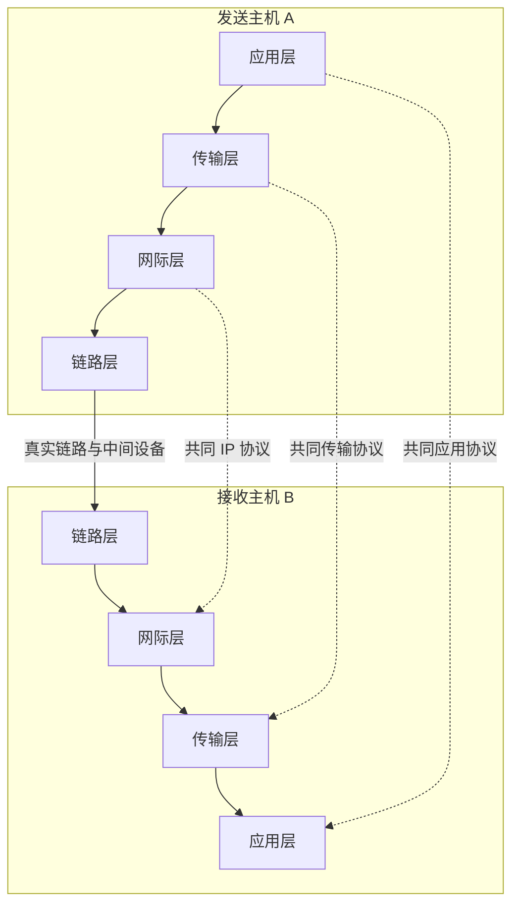

# 计算机网络 - 第 2 课：为什么要分层？

> 预计学习时间：约 2 小时  
> 这一课会从一个“什么都自己做”的 Unity 程序出发，推导出分层、封装和复用。请把层看成解决复杂度的工具，不要把它当成需要背诵的楼层表。

## 学习目标

本节结束后，你应该能够：

1. 解释网络为什么需要分层，以及分层带来的代价；
2. 区分**服务、接口和协议**；
3. 画出数据在发送端向下、接收端向上移动的过程；
4. 用自己的话解释封装与解封装；
5. 解释多个应用怎样共享同一套网络，以及接收端怎样把数据交给正确程序；
6. 初步区分应用数据、端口、IP 地址和一跳范围内的链路地址。

## 建议节奏

| 时间 | 内容 |
| --- | --- |
| 0:00–0:25 | 从“全能 Unity 程序”推导分层 |
| 0:25–0:50 | 服务、接口与协议 |
| 0:50–1:20 | 封装：一条消息怎样层层加上控制信息 |
| 1:20–1:40 | 复用与解复用 |
| 1:40–1:50 | 分层的收益、代价与常见误解 |
| 1:50–2:00 | 完成检查站 |

---

## 1. 假设 Unity 必须亲自管理一切

上一课中，玩家 A 的 Unity 程序想告诉玩家 B：

```text
玩家 42 跳跃了
```

假设世界上没有操作系统提供的通用网络功能。你的游戏必须亲自完成下面所有工作：

1. 把 `JumpEvent` 变成字节；
2. 控制 Wi-Fi 芯片产生无线信号；
3. 判断附近设备是否正在占用无线信道；
4. 发现家庭路由器；
5. 决定数据经过哪些网络；
6. 处理途中丢失、乱序和重复；
7. 防止发送太快压垮接收者；
8. 同时服务聊天、位置同步、下载资源等功能；
9. 换成网线时重新实现另一套信号规则；
10. 换一家运营商时再次修改游戏。

这不是“代码写得有点多”，而是职责纠缠在了一起。只想修改跳跃消息格式，却可能碰坏 Wi-Fi 发送；换一块网卡，游戏逻辑也要跟着变化。

如果你写过渲染器，可以想象一个类似的糟糕设计：

```cpp
void draw_triangle_and_open_window_and_parse_model_and_write_gpu_driver(...);
```

模型解析、三角形光栅化、窗口管理和硬件驱动挤在一个函数中。任何部分变化，整个系统都可能重写。

解决办法不是找一个更长的函数名，而是找到稳定边界，让每一部分只承担一类问题。

> [!note] 分层的第一层直觉
> **分层是把一个巨大通信问题，拆成若干可以独立理解和替换的子问题。** 每一层使用下一层提供的能力，再向上一层提供一种更方便的能力。

### 1.1 从最小需求开始拆

应用程序真正关心的是：

```text
把“玩家 42 跳跃”交给对方游戏程序。
```

应用并不想关心无线电波。于是我们尝试拆出几类工作：

| 层次 | 它主要回答的问题 | 给上一层的直觉 |
| --- | --- | --- |
| 应用层 | 字节在游戏中表示什么？收到后做什么？ | “这是一条跳跃事件” |
| 传输层 | 怎样把数据交给目标机器中的正确程序？是否需要可靠、有序？ | “把这些字节交给那个程序” |
| 网际层 | 数据怎样跨越多个网络，到达目标机器？ | “尽力把这个数据报送到那台机器” |
| 链路层 | 怎样把数据交给当前链路上的下一个设备？ | “把这一帧交给相邻的下一跳” |
| 物理层 | 怎样用电、光或无线信号表示比特？ | “把 0 和 1 送过这段介质” |

这里采用五层只是为了讲解方便。你以后可能看到：

- “TCP/IP 四层模型”把链路与物理合在一起；
- “OSI 七层模型”把应用附近再细分；
- 某些工程文档只讨论其中两三层。

层数不同不等于谁在撒谎。模型是观察系统的角度，不是宇宙中客观存在的五层楼。我们更关心职责边界，而不是背数字。

### 1.2 同层与相邻层

分层系统里有两种不同关系：

1. **本机相邻层之间**：应用调用本机操作系统提供的网络入口；网际层调用本机链路层。
2. **两端同一层之间**：A 的应用与 B 的应用遵守同一个游戏消息协议；A 的传输层与 B 的传输层遵守同一个传输协议。

图中实线是本机真实交付方向，虚线表示“按照共同协议看起来像在对话”：



A 的应用数据实际上是一路向下，经过网络，再在 B 一路向上。虚线不是一条绕过下层的秘密通道。

---

## 2. 三个很像、但不能混在一起的词

接下来区分**服务（service）**、**接口（interface）**和**协议（protocol）**。这是理解 CS144 后续内容的一个支点。

### 2.1 服务：这一层承诺做什么

服务描述“上一层能得到什么能力”，暂时不关心内部怎样做到。

例如，一个传输服务可能向应用承诺：

```text
你交给我的字节，会按顺序、无重复地交给对方。
```

另一个传输服务可能只承诺：

```text
我会尽力发送这一条消息，但不保证送达，也不保证顺序。
```

这两种服务适合不同需求。前者让应用省心，但遇到丢失的数据可能必须等待；后者限制少、等待少，但应用要接受数据可能消失或乱序。

以后讲“IP 服务模型”时，我们问的正是：**IP 这一层究竟向上承诺什么？**

### 2.2 接口：本机怎样使用服务

接口描述本机相邻模块怎样交互。对程序员来说，它可能表现为函数、类或系统调用。

用熟悉的 C++ 写成示意代码：

```cpp
class IByteSender {
public:
    virtual void send(std::span<const std::byte> data) = 0;
    virtual ~IByteSender() = default;
};
```

这个接口告诉调用者“怎样交数据”，但没有告诉你数据在网络线上长什么样，也没有说明另一台机器如何确认收到。

真实系统中的 Socket API 就属于应用与操作系统网络功能之间的重要接口。我们以后会单独实现和使用它。

### 2.3 协议：远端同层怎样共同工作

协议规定通信双方同一层的消息格式、字段含义和行为规则，例如：

- 哪些字节表示序号；
- 收到一段数据后是否需要确认；
- 多久没收到确认就重发；
- 哪个字段表示目标程序的端口。

它与 C++ 接口不同：接口主要约束本机调用关系，协议约束通过网络交流的两个实现。

可以把三者压缩成一句话：

> **服务说“我为你做什么”，接口说“你在本机怎样叫我做”，协议说“我和远端同层怎样合作完成”。**

### 2.4 一个餐厅类比，以及类比的边界

- 服务：餐厅承诺提供一顿饭；
- 接口：你通过菜单和服务员点餐；
- 协议：服务员与厨房使用编号和出餐规则协作。

类比能帮助起步，但不要依赖它证明技术细节。网络协议的两端可能跨越全球，中间还会有丢包、复制和乱序；餐厅通常没有这些性质。

---

## 3. 封装：每层只添加自己需要的控制信息

现在，应用产生了一段已经序列化的字节：

```text
JUMP player=42
```

传输层想知道应该交给目标机器中的哪个程序，于是添加自己的控制信息。网际层想知道最终目标机器，于是再添加自己的控制信息。链路层想知道当前这一跳交给谁，又添加一层控制信息。

这个过程叫**封装（encapsulation）**。

为了先看结构，我们用符号表示：

```text
应用数据：
[ JUMP player=42 ]

传输层封装后：
[ 传输层头部 | JUMP player=42 ]

网际层封装后：
[ IP 头部 | 传输层头部 | JUMP player=42 ]

链路层封装后：
[ 链路头部 | IP 头部 | 传输层头部 | JUMP player=42 | 链路尾部 ]
```

“头部”通常叫 header，“尾部”叫 trailer。它们都属于控制信息。上一层交下来的完整内容，对下一层来说就是 **payload（载荷）**。

> [!note] 重要视角
> 同一串字节是不是“载荷”，取决于你站在哪一层看。整个 IP 数据报是链路层的载荷；整个传输层数据块又是 IP 的载荷。

### 3.1 一个具体但暂不要求背诵的例子

假设游戏使用 UDP 发送 `JumpEvent`：

```text
经典以太网帧
┌────────────┬───────────┬────────────┬──────────────────┬────────────┐
│ Ethernet头 │ IPv4 头部 │ UDP 头部   │ JumpEvent 字节   │ Ethernet尾│
└────────────┴───────────┴────────────┴──────────────────┴────────────┘
```

每一层关心的标识不同：

| 信息 | 近似回答的问题 | 作用范围 |
| --- | --- | --- |
| 游戏消息类型、玩家 ID | 收到后在游戏中做什么？ | 两端游戏应用 |
| UDP 目标端口 | 交给目标主机中的哪个 Socket/程序？ | 端系统的传输层 |
| 目标 IP 地址 | 最终要到哪台主机？ | 跨越多个网络 |
| 目标链路地址 | 当前这一跳先交给哪个相邻设备？ | 当前一段链路 |

你现在不需要记住 UDP 或 Ethernet 字段。需要抓住的是：**每一层只添加完成自己职责所需的说明。**

### 3.2 为什么要有“当前下一跳”和“最终目标”两个地址？

假设你住在一栋不能直达机场的住宅：

```text
你的电脑 → 家庭路由器 → 运营商路由器 → …… → 游戏服务器
```

最终目标一直是游戏服务器，但当前能直接交付的对象最开始只是家庭路由器。每经过一段链路，“下一跳”可能改变；最终 IP 目标通常仍然是服务器。

因此，在通常的逐跳转发中：

- 链路层包装会在每一跳被取下并换成适合下一段链路的新包装；
- IP 数据报继续朝最终目标前进，其中某些字段（例如 TTL）会被路由器修改；
- 应用数据通常不需要被普通路由器理解。

这比“一个包裹从头到尾套着完全相同的多层信封”更准确。

### 3.3 接收端做相反的事

B 收到链路层数据后，会逐层检查并移除属于本层的控制信息：

```text
[链路头 | IP头 | UDP头 | JumpEvent | 链路尾]
                ↓ 链路层处理
        [IP头 | UDP头 | JumpEvent]
                ↓ IP 处理
              [UDP头 | JumpEvent]
                ↓ UDP 处理
                       [JumpEvent]
                ↓ 应用反序列化
                    玩家 42 跳跃
```

这叫**解封装（decapsulation）**。

注意，移除头部不是随便“删掉前几个字节”。每一层必须先按照协议解析字段、检查长度和类型，再决定把载荷交给谁。错误的长度字段可能让接收者错位读取，错误的类型可能让数据交给错误处理逻辑，严重时甚至产生安全问题。

### 3.4 小计算：有多少字节不是游戏内容？

假设应用消息有 32 字节，并暂时采用这些常见最小值：

- UDP 头部：8 字节；
- IPv4 头部：20 字节；
- 经典 Ethernet 头部与尾部合计：18 字节。

忽略额外选项、填充、前导码和物理层间隔，这一帧相关字节为：

```text
32 + 8 + 20 + 18 = 78 字节
```

真正的游戏内容只有 32 字节，控制开销有 46 字节。在很小的消息中，头部比例可能相当高；消息变大后，固定头部的比例下降，但消息又不能无限变大，因为链路一次能承载的数据块有上限。

这正是网络工程常见的取舍：批量发送能降低头部比例，却可能增加等待时间；小消息响应及时，却可能提高相对开销。

---

## 4. 复用：一套网络为什么能同时服务很多程序

你的电脑只有一块正在使用的 Wi-Fi 网卡，却能同时运行：

- 浏览器；
- Discord 或微信；
- Steam；
- Unity 游戏；
- DNS 查询。

这些通信不需要各自购买一块网卡。多个上层使用者共享同一个下层能力，叫**复用（multiplexing）**。

发送时，数据从多个来源汇入共享路径：

```text
浏览器 ─┐
聊天软件 ├→ 操作系统网络栈 → 一块网卡
Unity  ──┘
```

接收时，系统必须根据头部中的标识把数据分回正确处理者，叫**解复用（demultiplexing）**：

```text
一块网卡 → 检查类型与目标标识 ─┬→ 浏览器
                              ├→ 聊天软件
                              └→ Unity
```

### 4.1 三次连续选择

以一个装有游戏消息的 Ethernet/IPv4/UDP 数据为例，接收端大致会连续做三次选择：

1. Ethernet 类型字段表示载荷是 IPv4，于是交给 IPv4 处理逻辑；
2. IPv4 的协议字段表示载荷是 UDP，于是交给 UDP；
3. UDP 的目标端口表示应该交给哪个 Socket。

于是形成：

```text
网卡
  ↓ 根据链路类型字段
IPv4
  ↓ 根据 IP 协议字段
UDP
  ↓ 根据目标端口和本地绑定关系
某个游戏 Socket
  ↓ 根据游戏消息类型
JumpEvent 处理函数
```

每一层只需要看自己负责的那部分标识，不必理解所有上层含义。普通路由器为了转发 IP 数据，通常不需要知道 `playerId` 是多少，更不需要安装 Unity。

### 4.2 IP 地址与端口为什么不能互相替代？

上一课的 DNS 查询把 `example.com` 解析成一个或多个 IP 地址。选中一个 IP 后，它主要帮助数据到达某台目标主机。

但一台主机可以同时运行网页服务、游戏服务和其他程序。只有 IP 地址仍然不够，传输层还需要类似端口的标识，才能找到目标主机里的正确通信端点。

可以暂时记成：

```text
IP 地址：更像找到哪栋楼
端口：更像找到楼里的哪个收件窗口
```

这个类比也有边界：端口不是硬件插孔，也不总是永久属于某个程序；它是传输层用来参与识别通信端点的数字。

---

## 5. 分层为什么强大

### 5.1 上层可以复用下层

浏览器、游戏和聊天软件都能复用操作系统中的 TCP/IP 实现，不必各写一套网卡驱动和路由算法。

### 5.2 一层可以在接口稳定时被替换

从有线 Ethernet 换到 Wi-Fi，链路层和物理层实现发生变化，但游戏消息格式通常不必跟着重写。互联网能够把性质不同的底层网络连接起来，这种解耦非常重要。

### 5.3 每层可以独立演化

只要对外提供的服务和共同协议仍兼容，一层的内部实现可以优化。例如操作系统可以改进缓冲区和计时器，而应用仍继续使用熟悉的 Socket 接口。

### 5.4 故障可以按边界定位

当 `curl` 失败时，可以逐步问：

- 名字是否解析成地址？
- 是否能到达目标 IP？
- 传输连接是否建立？
- TLS 是否成功？
- HTTP 是否收到响应？

这比把所有失败都称作“网络不好”更接近工程分析。

---

## 6. 分层也有代价

分层不是免费午餐。

### 6.1 每层控制信息会产生开销

小消息中，头部可能比应用数据还多。某些实时游戏会合并多个小事件，正是在时延与开销之间做权衡。

### 6.2 不同层可能重复工作

链路层可能重传，传输层也可能重传；应用可能自己再做确认。它们保护的范围和目标不同，但如果设计不好就会浪费资源。

### 6.3 抽象有时会“漏”出来

应用虽然不操作光纤，却仍会感受到：

- 底层最大数据块限制；
- 无线网络延迟抖动；
- 拥塞造成排队；
- 移动网络切换导致地址变化。

这种现象常被称为“抽象泄漏”：上层不必理解全部细节，但某些底层性质无法永远隐藏。

### 6.4 真实网络并不总是严格守层

防火墙、NAT、代理和负载均衡器可能查看或修改不止一层的信息。网卡硬件也可能替操作系统完成部分 TCP/IP 工作。

所以分层是一套强大的设计原则和心智模型，不是一条“设备只能看某个头部”的自然定律。

---

## 7. 用 TinyNet 预演封装

以后我们会真正实现数据报。现在先用接近 C++ 的伪代码看清结构，不需要运行：

```cpp
Bytes app_payload = serialize(JumpEvent{.player_id = 42});

Bytes udp_datagram = udp.wrap(
    /* destination_port = */ 7777,
    app_payload
);

Bytes ip_datagram = ip.wrap(
    /* destination_ip = */ game_server,
    udp_datagram
);

Bytes link_frame = link.wrap(
    /* next_hop = */ home_router,
    ip_datagram
);

network_interface.send(link_frame);
```

接收端的结构相反：

```cpp
auto ip_datagram  = link.unwrap(link_frame);
auto udp_datagram = ip.unwrap(ip_datagram);
auto app_payload  = udp.unwrap(udp_datagram);
auto jump_event   = deserialize<JumpEvent>(app_payload);
```

真实代码不会简单到只有这些函数：需要校验长度、类型、校验和、地址与错误情况。但这段伪代码已经给我们一个稳定骨架。后续每个 Lab 都是在骨架的某个位置，把一个 `wrap` 或 `unwrap` 逐步变成真实机制。

### 7.1 手工封装练习

请拿纸或在 Obsidian 中写出下面四行，不要复制上文：

1. 应用数据写 `JUMP 42`；
2. 在外面加一个“目标端口 7777”的框；
3. 再加一个“目标 IP = 游戏服务器”的框；
4. 最外面加一个“下一跳 = 家庭路由器”的框。

然后回答：当家庭路由器把数据交给运营商路由器时，四个框中最可能需要换掉的是哪一个？为什么？

---

## 8. 常见误解校正

### “五层意味着数据会经过五台设备”

不是。层主要是职责与协议边界。同一台主机内就可以实现多层；一个路由器也会实现链路层和网际层等必要功能。

### “上一层一定比下一层更重要”

不是。层的上下只表示依赖方向。没有可靠的物理与链路能力，上层无法通信；没有应用含义，搬运字节也没有最终目的。

### “用了分层，上层就永远不用知道底层”

不是。上层通常不操作底层细节，但延迟、最大数据大小和拥塞等性质可能影响应用设计。

### “所有网络通信都经过 TCP”

不是。TCP 是一种传输协议，UDP 是另一种；IP 上还可以承载其他协议。后面我们会比较它们提供的服务。

### “IP 地址能直接找到 Unity 进程”

不够。IP 主要把数据带到主机；传输层端口和 Socket 绑定等信息继续帮助系统选择目标通信端点。

## 知识锚点

- Stanford CS144 把数据报、封装与复用放在课程开端，因为后续可靠传输、TCP、交换和路由都依赖这套层次视角：[CS144 官方课程页](https://cs144.github.io/)。
- UDP 的正式格式与端口字段记录在 [RFC 768](https://www.rfc-editor.org/rfc/rfc768.html)；IPv4 的头部与协议字段记录在 [RFC 791](https://www.rfc-editor.org/rfc/rfc791.html)。现在不要求阅读规范正文，链接用于以后查证。

## 小结

1. 分层把巨大通信问题拆成职责稳定、可以复用和替换的子问题。
2. 服务说“做什么”，接口说“本机怎样调用”，协议说“远端同层怎样合作”。
3. 发送端逐层添加控制信息叫封装；接收端逐层解析并取出载荷叫解封装。
4. IP 地址、端口和链路地址回答不同范围内的“交给谁”。
5. 复用让多个应用共享网络；解复用依据逐层标识把数据交回正确处理者。
6. 分层带来模块化，也带来头部开销、重复工作和抽象泄漏。

---

## 检查站

请先合上本课或滚动到看不到正文的位置，再用自己的话回答。

1. 分别用一句话说明服务、接口和协议。再用一个 C++ 或 C# 中的例子说明三者为什么不是同一件事。
2. 一个 `JumpEvent` 通过 UDP/IP/Wi-Fi 发出时，发送端封装的大致顺序是什么？接收端为什么要反过来？
3. 一台电脑同时运行两个联网游戏。数据已经到达这台电脑后，为什么只有目标 IP 地址还不够？系统还需要什么信息帮助解复用？
4. 游戏本来使用有线 Ethernet，后来改用 Wi-Fi。按照分层思想，哪些部分应该尽量保持不变，哪些部分必须改变？
5. 数据从电脑经过家庭路由器再到运营商路由器。为什么“最终目标 IP”和“当前链路的下一跳地址”不能只保留一个？哪类包装通常会在每一跳更换？
6. 应用数据为 100 字节，假设 UDP、IPv4、Ethernet 的控制信息仍分别为 8、20、18 字节。忽略其他开销：总共是多少字节？其中多少是应用数据，多少是控制开销？

附加迁移题：请给出一个**不是公路、也不是打印机**的例子，分别指出其中什么对应延迟、什么对应带宽。这会帮助我们关闭第 1 课留下的小遗漏。

请把答案直接告诉我。我会根据回答决定：直接进入 IP 服务模型，还是先写一篇针对分层或封装的补充说明。

---

## 我的手工封装与疑问

> 在这里保存你的四层框图、检查站答案或不确定的地方。

