# 第 5 课：把一次发送完整走通

> 课堂阅读版：不需要电脑，不需要完成 Lab 0
>
> 预计时间：认真阅读 60–90 分钟；完成纸笔推演与检查站约 30–45 分钟
>
> 当前状态：提前阅读。读完不自动算“掌握”，回答检查站后再判断。

前面三课像是在桌上摆零件：序列化、分层、UDP、IP、链路、TTL、路由器、队列。每个词单独看并不算太难，真正容易混乱的是：**一次发送发生时，它们究竟按什么顺序合作？**

这一课暂时不增加很多新零件。我们要像 TinyRenderer 在画完几个局部功能后，停下来把一帧图像的整个流水线走一遍那样，把一条消息从发送端一直跟到接收端。

## 学习目标

本课结束后，你应该能够：

1. 从一个 C# 对象开始，按顺序解释它怎样变成对方程序能够理解的消息；
2. 区分应用消息、UDP 数据报、IP 数据报与链路帧各自负责什么；
3. 解释路由器每一跳会检查、修改和替换哪些信息；
4. 说清“路由”和“转发”为什么不是一回事；
5. 把延迟拆成处理、排队、发送和传播四个来源；
6. 面对“发送成功但对方没反应”，按路径逐段推理，而不是只猜网络坏了。

---

## 1. 先固定一个具体场景

假设游戏客户端产生了这样一个事件：

```csharp
var jump = new JumpEvent
{
    PlayerId = 42,
    Sequence = 501,
    ClientTick = 1083
};
```

玩家 42 在客户端的第 1083 个逻辑时刻按下了跳跃键。我们希望把它发送给服务器。

这里第一件要警惕的事是：

> `jump` 是本进程里的对象，不是网络中天然存在的东西。

它可能包含字段、对象引用、运行时类型信息，甚至对 Unity 原生对象的句柄。远端机器既看不到这块内存，也不能使用这里的引用。

所以真正的起点不是“把对象塞进网线”，而是应用先做一个决定：

> 我究竟想把这个对象中的哪些信息告诉对方？这些信息用什么字节表示？

例如，我们暂时约定：

```text
消息类型        1 字节：01 表示 JumpEvent
PlayerId        4 字节：00 00 00 2A
Sequence        4 字节：00 00 01 F5
ClientTick      4 字节：00 00 04 3B
```

于是应用消息一共 13 字节。这里先忽略大小端、压缩和版本兼容；重要的是看见：

```text
C# 对象
   ↓ 应用协议决定保留哪些字段、怎样编码
13 字节应用消息
```

应用协议不仅规定字段排列，还要规定：

- 数字使用几个字节；
- 字节顺序是什么；
- `01` 代表哪种消息；
- 缺少字段时怎么办；
- 新旧版本如何共存；
- 收到重复或过期事件时怎么办。

因此，“能够把字节送到对方”与“对方能够正确理解”是两个不同问题。

### 想一想

如果发送方把 `PlayerId` 写成 4 字节，而接收方按 2 字节读取，网卡和路由器有没有做错什么？

<details>
<summary>展开答案</summary>

没有。字节可能被完整送达，但双方对字节边界和含义的约定不同。这是应用协议错误，不是 IP 转发错误。

</details>

---

## 2. 同一份数据，会被几层人用不同眼光看

这 13 字节进入操作系统后，不同层关心的事情不同。

```text
应用层：这是不是 JumpEvent？PlayerId 是多少？
传输层：应该交给目标机器上的哪个端口？
网络层：最终要送到哪个 IP 地址？
链路层：在当前这一小段链路上，下一步交给谁？
```

可以把封装画成嵌套盒子：

```text
链路帧
┌──────────────────────────────────────────────────┐
│ 链路头 │ IP 数据报                               │ 链路尾 │
│        │ ┌─────────────────────────────────────┐ │        │
│        │ │ IP 头 │ UDP 数据报                  │ │        │
│        │ │       │ ┌─────────────────────────┐ │ │        │
│        │ │       │ │ UDP 头 │ 13 字节应用消息│ │ │        │
│        │ │       │ └─────────────────────────┘ │ │        │
│        │ └─────────────────────────────────────┘ │        │
└──────────────────────────────────────────────────┘
```

不要把“头部”想成写在纸箱外面的中文标签。它们同样是一串字节，只是协议规定其中某些位置表示端口、地址、长度、TTL 等信息。

### 四个名字分别回答什么问题

| 名称 | 本课中的核心问题 | 大致使用者 |
| --- | --- | --- |
| 应用消息 | 这些字节在游戏里是什么意思？ | 客户端与服务器代码 |
| UDP 数据报 | 到达主机后应该交给哪个端口？ | 两端操作系统的 UDP 实现 |
| IP 数据报 | 跨越多张网络后，最终要去哪个主机地址？ | 主机与路由器的 IP 实现 |
| 链路帧 | 在当前这一跳上，应该交给谁？ | 当前链路两端的网卡或接口 |

这里没有哪一层“更真实”。它们是在同一批字节上建立的不同范围的约定。

---

## 3. 发送函数返回成功，到底成功到了哪里

应用调用一个类似下面的函数：

```csharp
socket.SendTo(bytes, serverEndPoint);
```

假设它返回成功。最稳妥的理解通常是：

> 操作系统已经接受了这次发送请求以及对应字节。

它通常不能单独证明：

- 数据已经离开网卡；
- 家庭路由器已经收到；
- 中间没有丢包；
- 服务器操作系统已经收到；
- 服务器程序已经读取；
- 服务器成功反序列化；
- 游戏逻辑已经接受这个事件。

为了看清边界，可以把路径拆成一连串交接：

```text
游戏代码
  ↓ 交给本机 Socket
操作系统发送缓冲与协议栈
  ↓ 交给网卡
第一段链路
  ↓ 交给家庭路由器
更多路由器与链路
  ↓ 交给服务器网卡
服务器操作系统协议栈
  ↓ 交给目标 Socket
服务器游戏代码
```

每一次“交接成功”都只是路径上的局部事实。

这和 C++ 中向一个队列执行 `push` 很相似：`push` 成功能说明元素进入队列，但不能说明另一个线程已经取出并正确处理。网络只是把中间交接扩展到了更多设备和协议。

### 一个重要的调试习惯

当你以后遇到“客户端说发送成功，服务器却没反应”，不要立即问：

> 网络为什么没把它送到？

先问得更精确：

> 我目前有什么证据，能证明这条路径已经走到哪一步？

日志、抓包、端口状态、服务器接收日志和反序列化错误，分别能证明不同边界。

---

## 4. 第一跳：最终目标与当前下一跳同时存在

假设路径是：

```text
A（客户端） → R1（家庭路由器） → R2（运营商路由器） → B（服务器）
```

IP 数据报的最终目标是 B。但是 A 通常不能直接在本地链路上把帧交给远方的 B；它先把当前链路帧交给 R1。

因此两种“目标”会同时存在：

```text
IP 目标：B
当前链路下一跳：R1
```

在 TinyNet Lab 0 中，它们对应：

```cpp
datagram.destination  // 最终目标
outbound.next_hop     // 当前下一跳
```

如果只留下 `next_hop`，R1 收到后就不知道最终想去 B；如果只留下最终目标 B，当前链路又缺少“这一跳交给 R1”的信息。

### 为什么不能把两者合并

它们的有效范围不同：

- 最终目标要跨越整个路径，帮助沿途路由器继续做决定；
- 下一跳只负责当前链路，走完这一跳就完成使命。

这是一种会在网络中反复出现的设计方法：

> 不同有效范围的信息，不要因为名字相似就强行塞进同一个概念。

---

## 5. 路由器到底做了什么

R1 收到一个链路帧后，可以把核心过程简化为：

```text
1. 接收当前链路帧
2. 去掉当前链路的包装，取出 IP 数据报
3. 检查数据报是否还能转发
4. 让 TTL 减 1
5. 根据最终目标 IP 查转发表
6. 选择出口与下一跳
7. 如果出口队列有空间，就排队
8. 轮到发送时，为下一段链路制作新的链路帧
```

注意第 2 步和第 8 步：R1 不会把 A 制作的原链路帧原封不动地扔给 R2。原来的链路包装只适用于 A 到 R1 这一段。

路径上的包装变化可以画成：

```text
A → R1：链路包装 [A → R1]，IP [A → B]
R1 → R2：链路包装 [R1 → R2]，IP [A → B]
R2 → B：链路包装 [R2 → B]，IP [A → B]
```

这里先把设备地址抽象成名字；以后学习 Ethernet 与 ARP 时，再把它们落实成 MAC 地址和地址解析过程。

### 哪些东西通常改变

每经过一台普通路由器：

- 原链路头尾被去掉；
- 新链路头尾为下一段链路重新创建；
- TTL 减 1；
- IPv4 头部校验和因为 TTL 变化而重新计算；
- 出口、下一跳和排队时间可能不同。

### 哪些东西通常保持

暂时忽略 NAT、隧道等后续机制时：

- 来源 IP 仍然指向 A；
- 目标 IP 仍然指向 B；
- UDP 来源与目标端口通常不变；
- 应用载荷通常不变。

“通常”两个字很重要。网络里确实存在会修改地址、端口或重新包装整个数据报的设备，但我们先建立普通转发路径，再研究例外。

---

## 6. TTL 不是时间倒计时

TTL 的全名包含“Time”，但在今天的普通 IP 转发中，可以先把它理解为：

> 数据报还允许被多少台路由器继续转发。

路径：

```text
A → R1 → R2 → B
```

若初始 TTL=3：

| 位置 | 路由器处理前 | 处理结果 |
| --- | ---: | --- |
| R1 | 3 | 减为 2，继续转发 |
| R2 | 2 | 减为 1，继续转发 |
| B | 1 | 到达最终主机，不再由路由器继续转发 |

若初始 TTL=2：

| 位置 | 路由器处理前 | 处理结果 |
| --- | ---: | --- |
| R1 | 2 | 减为 1，继续转发 |
| R2 | 1 | 不能继续转发，丢弃 |

TTL 解决的是“错误路由导致数据报一直绕圈”的问题。它不保证数据报一定到达，只保证它不会在路由环路中无限活着。

### 想一想

TTL=64 是否意味着数据报可以在网络中存活 64 秒？

<details>
<summary>展开答案</summary>

不意味着。对我们当前研究的普通转发过程，应按路由器跳数理解：每经过一台路由器至少减少 1。

</details>

---

## 7. “路由”和“转发”不是同一个动作

日常说话时，人们经常把两者混在一起，但理解网络时最好分开。

### 转发：处理眼前这个数据报

转发回答：

> 这个数据报现在到了，我应该从哪个出口把它交给哪个下一跳？

它发生得非常频繁。路由器收到许多数据报，就要许多次查表、排队和发送。

### 路由：形成做决定所需的地图

路由回答：

> 为了到达不同目标，我的转发表中应该有哪些规则？这些规则从哪里来？

规则可能由管理员直接配置，也可能由路由协议计算和交换得到。具体协议以后再学。

### 一个 C++ 类比

```cpp
router.add_route(route);      // 把一条规则放进地图
router.receive(datagram);     // 用现有地图处理眼前的数据报
```

Lab 0 把路由规则直接交给 `add_route`，重点练习的是**转发**。它没有实现互联网中路由器如何互相学习规则。

可以把两者记成：

```text
路由：造地图、更新地图
转发：拿着地图处理眼前一个数据报
```

以后我们会发现，Lab 0 的“目标地址完全相等才匹配”过于简单。真实 IP 转发表通常用地址前缀表示一组目标，并使用最长前缀匹配。现在只要知道这个缺口，不需要提前背算法。

---

## 8. 队列为什么同时制造延迟和丢包

假设 R1 的某个出口每秒只能发送 1 个数据报，而短时间内来了很多数据报。

路由器有三个选择：

1. 让后来者等待；
2. 把某些数据报丢掉；
3. 不现实地瞬间提高物理发送能力。

普通有限队列采用前两种：还有位置就等待，满了就丢掉一部分。

假设队列容量为 2，同时按 D1、D2、D3 的顺序入队：

```text
开始：[]
D1 到达：[D1]
D2 到达：[D1, D2]
D3 到达：队列已满，D3 被队尾丢弃
```

发送时：

```text
第一个发送机会：D1 离开
第二个发送机会：D2 离开
```

D2 没有丢，但它比 D1 多等了一段时间。这就是排队延迟。

### 把容量改成 100 就更好吗

更大的队列可以在一次突发流量中暂时保存更多数据报，可能减少立即丢包；但等待队伍也可能变得更长。

对于实时游戏，等了几秒才到达的旧位置更新往往已经失去价值。于是：

> “不丢”不一定等于“有用”；过大的排队延迟也可能是一种失败。

这正是为什么网络性能不能只看丢包率，还要看延迟及其波动。

---

## 9. 延迟不是一个来源

一份数据经过一段链路时，常把延迟拆成四类：

```text
处理延迟 + 排队延迟 + 发送延迟 + 传播延迟
```

### 9.1 处理延迟

设备读取必要头部、检查错误、查表和决定出口所花的时间。

### 9.2 排队延迟

数据报已经知道要走哪个出口，但前面还有其他数据等待发送。

它的变化通常最大：空闲时可能几乎没有，拥塞时可能迅速增加。

### 9.3 发送延迟

把数据报的全部比特依次推入链路所需的时间。

如果一份数据有 `L` 比特，链路速率为每秒 `R` 比特，那么：

```text
发送延迟 = L / R
```

例如，1200 字节是 9600 比特。在 10 Mbit/s 的链路上，忽略其他开销：

```text
9600 / 10,000,000 秒 = 0.00096 秒 = 0.96 毫秒
```

带宽越高，同样数据的发送延迟通常越小。

### 9.4 传播延迟

信号从链路一端传播到另一端所需的时间，取决于距离和介质中的传播速度。

提高带宽不等于缩短地理距离。因此把 10 Mbit/s 升级到 1000 Mbit/s，可以大幅缩短大文件被推入链路的时间，却不会让跨洲信号瞬间到达。

### 一条路径的总延迟

路径有多台路由器和多段链路时，每一跳都可能贡献处理、排队、发送和传播延迟：

```text
总延迟 ≈ 各跳四类延迟之和
```

这不是要求你现在做精密建模，而是帮助你停止把所有等待都叫作“网速慢”。

### 想一想

网络空闲时延迟稳定，一到晚上就忽高忽低。四类延迟中，哪个最值得先怀疑？

<details>
<summary>展开答案</summary>

排队延迟。晚上更多用户竞争共享出口，队伍长度随流量不断变化。仅凭这一现象还不能百分之百定案，但它是合理的第一假设。

</details>

---

## 10. 到达 B 之后，还没有结束

R2 把数据报放进发往 B 的链路帧。B 的网卡和操作系统收到后，会反向拆解：

```text
链路层：这个帧是否交给本机接口？
   ↓ 取出 IP 数据报
IP 层：目标 IP 是否是本机？上层协议编号是什么？
   ↓ 交给 UDP
UDP：目标端口对应哪个 Socket？
   ↓ 交给进程
应用：这些字节是不是合法的 JumpEvent？是否过期或重复？
```

这就是解复用：从共同路径上的数据中，利用一层层标识把它交给正确的处理者。

如果同一台服务器同时运行两个游戏服务，仅有目标 IP 不够，因为 IP 只能先找到主机。UDP 目标端口帮助操作系统继续找到正确 Socket。

应用最终还要验证：

- 消息类型是否合法；
- 长度是否正确；
- 玩家是否有权控制该角色；
- `Sequence` 是否重复或过期；
- 当前游戏状态是否允许跳跃。

所以即使字节完全到达，游戏逻辑也可能合理地拒绝它。

---

## 11. 一次失败可能发生在哪里

现在再看“服务器没让角色跳起来”，可能性远不止“丢包”。

| 位置 | 示例 | 属于哪类问题 |
| --- | --- | --- |
| 客户端应用 | 序列化字段顺序错误 | 应用协议 |
| 客户端 Socket | 目标端口写错 | 接口使用或配置 |
| 本机协议栈 | 没有可用路由 | 网络配置 |
| 某台路由器 | TTL 过期 | IP 转发 |
| 某个出口 | 队列已满 | 拥塞与排队 |
| 某段链路 | 帧损坏或无线信号差 | 链路传输 |
| 服务器防火墙 | UDP 端口被过滤 | 安全策略 |
| 服务器 Socket | 程序没及时读取 | 应用或系统负载 |
| 服务器应用 | 反序列化版本不一致 | 应用协议 |
| 游戏逻辑 | 事件过期、重复或无权限 | 游戏规则 |

有了这张表，调试就变成逐步缩小范围：

```text
发送前字节正确吗？
本机真的发出了吗？
数据到服务器主机了吗？
到正确端口了吗？
应用读到了吗？
解析成功了吗？
业务逻辑接受了吗？
```

专业调试很少依赖一次猜中。它依赖把长路径分成可验证的边界。

---

## 12. 为什么 IP 故意只提供“尽力而为”

到这里，你可能会觉得 IP 的承诺很弱：

- 不保证送达；
- 不保证顺序；
- 不保证不重复；
- 不保证延迟；
- 不保证带宽；
- 不理解游戏消息；
- 不负责最终比赛结果必须可靠。

但这种“弱”带来一个重要能力：许多不同需求可以共同使用它。

```text
文件下载：愿意等待重传，重视完整正确
语音通话：旧声音太晚到可能不如丢掉
实时位置：更关心最新状态，旧快照可能过期
比赛结果：必须可靠、可确认，不能悄悄缺失
```

IP 只负责把独立数据报向目标方向转发。应用和传输层可以在它上面增加不同机制：

- TCP 可以用序号、确认、计时器、重传、缓存等提供可靠有序字节流；
- 使用 UDP 的应用可以自行定义序号、快照、确认或重传策略；
- 同一个游戏甚至可以让不同类型的消息采用不同可靠性策略。

这体现了分层的重要价值：

> 下层提供一个范围清楚的共同基础，上层根据自己的目标增加语义。

### Unity 视角：两类消息

不断更新的位置：

```text
t=100：位置 (10, 5)
t=101：位置 (11, 5)
t=102：位置 (12, 5)
```

如果 `t=100` 丢了，而 `t=102` 已经到达，执着于等待旧位置可能反而让画面落后。

最终比赛结果则不同：

```text
Winner = Player 42
FinalScore = 7 : 5
```

它通常需要明确确认、重复抑制、持久保存或重新查询等保障。

这里先建立设计直觉，不急着决定具体 API。

---

## 13. 把整条路径压缩成一张图

```mermaid
flowchart LR
    A[C# JumpEvent] --> B[应用序列化]
    B --> C[UDP 添加端口信息]
    C --> D[IP 添加来源、目标和 TTL]
    D --> E[链路包装：A 到 R1]
    E --> R1[R1：拆链路包装、TTL-1、查表、排队]
    R1 --> F[新链路包装：R1 到 R2]
    F --> R2[R2：拆链路包装、TTL-1、查表、排队]
    R2 --> G[新链路包装：R2 到 B]
    G --> H[B：IP 按协议解复用]
    H --> I[UDP 按端口解复用]
    I --> J[应用反序列化并检查游戏规则]
```



如果设备无法显示 Mermaid，就按下面的文字版阅读：

```text
对象
→ 应用消息字节
→ UDP 数据报
→ IP 数据报
→ 当前链路帧
→ 路由器逐跳拆链路包装、改 TTL、查表、排队、重做链路包装
→ 目标主机按 IP 协议号和 UDP 端口解复用
→ 目标应用解释字节并决定是否接受
```

### 一句完整叙述

你最终要能说出类似这样的话：

> 游戏先按照应用协议把 `JumpEvent` 中需要传递的状态序列化成字节；UDP 用端口帮助目标主机找到 Socket，IP 用最终目标地址让多个路由器逐跳转发，每一跳会替换链路包装、减少 TTL 并可能排队或丢弃；到达目标主机后，系统反向解复用到服务器进程，服务器再按同一应用协议反序列化并检查这条消息是否有效。

不需要背这段原句。能用自己的语言重新搭出因果链才算真正掌握。

---

## 14. 课堂纸笔实验：跟踪三个数据报

不运行代码，也可以模拟 Lab 0。

网络：

```text
A → R1 → R2 → B
```

已知：

- R1 和 R2 都有通向 B 的规则；
- 每个出口队列容量为 2；
- 当前队列最初为空；
- D1、D2、D3 按顺序到达 R1，且出口暂时来不及发送；
- 三个数据报的初始 TTL 都是 3；
- 它们的载荷分别是 `P1`、`P2`、`P3`。

请先在纸上填写：

| 数据报 | R1 的接收结果 | 离开 R1 时 TTL | 是否到达 R2 | 最终情况 |
| --- | --- | ---: | --- | --- |
| D1 |  |  |  |  |
| D2 |  |  |  |  |
| D3 |  |  |  |  |

<details>
<summary>完成推演后再展开一种合理答案</summary>

在题目明确“出口暂时来不及发送”的情况下：

- D1 入队，TTL 从 3 变为 2；
- D2 入队，TTL 从 3 变为 2；
- 队列已经有两个数据报，D3 被队尾丢弃，不到 R2；
- D1、D2 之后按 FIFO 顺序离开 R1；
- 它们到 R2 时 TTL=2，R2 转发后变成 1，可以到达 B。

如果题目没有说明出口是否同时发送，那么必须进一步说明时间模型；这不是抬杠，而是发现题目隐含条件。

</details>

### 再改变一个变量

如果 D1 的初始 TTL 改成 2，其他不变：

```text
R1：收到 TTL=2，转发后 TTL=1
R2：收到 TTL=1，停止转发
B：收不到 D1
```

这里即使所有队列都有空间，D1 仍会因为 TTL 而丢弃。不同丢包原因可以得到相同的应用现象，所以调试需要更多证据。

---

## 15. 五个常见混淆，集中拆开

### 混淆一：域名就是服务器 IP

域名是供人和应用使用的名字；DNS 可以把名字解析成一个或多个地址。程序选择其中一个地址尝试连接。名字、地址和实际机器不是同一个概念。

### 混淆二：有 IP 就能找到目标程序

IP 先帮助找到目标主机。目标端口继续帮助 UDP/TCP 把数据交给正确 Socket。

### 混淆三：发送成功等于对方处理成功

发送函数成功通常只是某个局部交接成功。端到端处理还要跨越许多边界。

### 混淆四：带宽高就一定延迟低

带宽影响单位时间能推出多少比特，却不能消除传播距离、设备处理和排队。二者相关，但不是同一个量。

### 混淆五：可靠性必须由 IP 提供

可靠机制可以建立在不可靠 IP 之上。TCP 是一个重要例子；应用也可以为特定消息定义自己的确认和重试规则。

---

## 知识锚点

- IP 数据报携带来源地址、最终目标地址、TTL 和上层协议标识等信息；路由器根据目标地址逐跳转发。
- TTL 在每次路由器转发时减少，耗尽时停止转发，用来限制数据报在错误路径中的寿命。
- UDP 端口与 IP 地址解决不同层次的解复用问题。
- 一段链路上的延迟常拆成处理、排队、发送与传播四部分。
- Lab 0 使用精确目标匹配和手工添加路由，是对转发过程的教学简化，不是完整互联网路由器。

---

## 小结

1. 对象先按应用协议变成字节，网络不会自动理解 C# 或 Unity 对象。
2. UDP 端口、最终 IP 地址与当前链路下一跳分别解决不同范围的问题。
3. 路由器逐跳替换链路包装、减少 TTL、查表并排队；队列既会增加延迟，也可能溢出丢包。
4. 路由负责形成地图，转发负责使用地图处理眼前的数据报。
5. 发送成功只是局部事实；目标应用正确处理才是另一端的最终事实。
6. IP 的承诺有意保持简单，可靠性和游戏语义可以由 TCP 或应用在上层增加。

---

## 检查站

请先滚动到看不到正文的位置，再用自己的话回答。课堂里不需要运行任何命令。

1. 从 `JumpEvent` 对象开始，一直说到服务器游戏逻辑收到它为止。至少说出序列化、UDP、IP、链路帧、路由器和反序列化分别在做什么。

jumpEvent serialize->udp添加目标端口，udp头封装->添加ip头->添加链路头尾，路由器逐跳转发->目标逐层解封装，反序列化

2. 在 `A → R1 → R2 → B` 中，分别说明最终目标 IP、当前下一跳、UDP 目标端口的作用范围。为什么不能只保留其中一个？

最终目标ip一直保留，这样当前路由器才知道下一跳，当前下一跳逐跳改变，目标udp端口在ip将数据报送到目标时帮助找到对应端口

3. 初始 TTL=3 时，数据报经过 R1、R2 后到达 B 的 TTL 是多少？初始 TTL=2 时又在哪里被丢弃？

0，R2

4. 用一句话区分“路由”和“转发”。Lab 0 的 `add_route` 与 `receive` 更接近哪一个？

路由相当于更新地图，转发是对数据报处理，每跳都转发不一定路由

5. 某出口队列容量为 2，出口暂时无法发送，D1、D2、D3 依次到达。写出每次到达后的队列，并说明谁产生排队延迟、谁被丢弃。

d1,d1d2,d1d2（丢弃d3）
因为无法发送，都有延迟，d3

6. 发送一个 1200 字节的数据报，忽略其他开销。链路为 12 Mbit/s 时，发送延迟是多少？如果升级到 120 Mbit/s，哪一类延迟会直接缩短十倍，哪几类不一定？

1200/12M，传播延迟缩短，其他不一定

7. `SendTo` 返回成功，但服务器角色没有跳起来。请列出至少四个可能失败的位置，而且四个位置不能都属于同一层。

反序列化错，丢包，链路断，传输协议不一致

8. IP 不保证送达和顺序，为什么 TCP 仍然能够向应用提供可靠、有序的字节流？不必背完整算法，但要说明它增加了哪些机制。

排序，补发，去重

9. 对“不断更新的位置”和“最终比赛结果”，分别说明晚到的旧消息与丢失消息应该怎样看待。

位置旧消息丢弃，比赛结果不丢

10. 附加思考：如果每一台路由器都必须理解 `JumpEvent` 并保存每个游戏玩家的状态，互联网会失去哪些灵活性？

路由器更加复杂，传输难度更大，职责交错，抽象过于泄露

把答案发给我后，我会把它当作一次概念图谱检查。明天完成 Lab 0 后，我们再把“纸上能解释”和“代码能运行”合并起来判断掌握程度。

---

## 教师反馈（2026-09-02）

总体判断：**部分理解，主路径已经建立；先完成 [[05b_TTL与四种延迟补充|Lesson 5B]]，暂不把第 5 课标记为掌握。**

这不是因为 Lab 尚未完成。Lab 相关内容已经单独保留；当前需要修正的是理论回答中的两个核心混淆：TTL 到达值，以及发送延迟与传播延迟。

1. 主顺序正确：序列化 → UDP → IP → 链路包装 → 路由器逐跳转发 → 反向拆解与反序列化。还可以补上：目标 IP 层根据协议号交给 UDP，UDP 再根据目标端口交给对应 Socket，应用最后还要验证消息是否合法。
2. 基本正确。更精确地说，最终目标 IP 供沿途每一台路由器查表；当前下一跳只服务于眼前这一段链路；UDP 目标端口在目标主机内帮助找到 Socket。它们的作用范围不同，不能互相代替。
3. 前半错误，后半正确。初始 TTL=3 时：R1 把 3 减为 2，R2 把 2 减为 1，B 收到时是 1，不是 0。初始 TTL=2 时，R1 转发后变成 1，R2 看到 TTL=1 后丢弃。
4. 定义正确，但映射没有明确写完：`add_route` 更接近建立或更新地图；`receive` 更接近拿现有地图转发眼前的数据报。
5. 队列变化正确。D1、D2 都产生排队延迟，D2 通常等得更久；D3 在队列已满时立即被丢弃，并没有进入队列等待。
6. 两处都需要修正。1200 字节是 9600 比特，发送延迟为 `9600 / 12,000,000` 秒，即 0.0008 秒，也就是 0.8 毫秒。升级到 120 Mbit/s 后直接缩短十倍的是**发送延迟**；传播、处理和排队延迟不一定同步缩短。
7. 方向正确，但“丢包”是现象，不是具体位置。可以更精确地列为：客户端序列化错误、路由器因 TTL 或队列满而丢弃、服务器防火墙过滤目标端口、服务器应用反序列化或游戏规则拒绝。
8. 骨架正确。排序、补发和去重通常依赖序号、确认、计时器、重传和接收缓存等具体机制。
9. 正确。旧位置通常可以丢弃并采用更新状态；最终比赛结果需要确认、重传或重新查询等可靠保障。
10. 正确。路由器会与具体应用强耦合，状态量和升级成本急剧增加，也难以让新应用复用同一网络基础。

完成 Lesson 5B 的四道复测题后，再重新判断第 5 课掌握程度。
