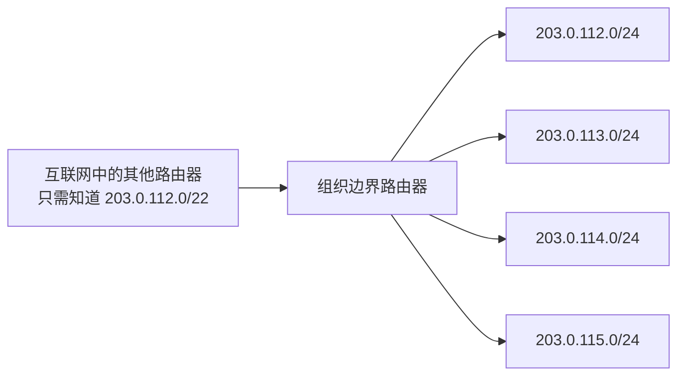

# 第 6 课：从“每台主机一条路由”到网络前缀

> 预计时间：正文与随堂思考 70–100 分钟；纸笔练习与检查站 30–50 分钟
>
> 所需工具：纸和笔即可，不需要电脑
>
> 当前状态：新课。读完不自动算掌握；完成文末检查站后再判断。

在 Lab 0 中，我们写过一种很简单的路由规则：

```text
如果目标地址正好等于 10.0.0.7，就从接口 1 发给下一跳 R2。
```

这足以让一个只有几个节点的 TinyNet 工作，但它藏着一个规模问题。

假设路由器要连接的不是三台主机，而是整个互联网。如果每一个可能的目标 IP 都需要一条单独规则，那么路由表会变得巨大；新增加一台主机，许多路由器还可能要跟着增加规则。

这一课要解决的问题是：

> 能不能用一条规则代表一整组地址，同时在规则重叠时仍然作出确定的选择？

答案就是**网络前缀**与**最长前缀匹配**。我们仍然先从需要出发，再给术语。

## 学习目标

本课结束后，你应该能够：

1. 把 IPv4 地址看作 32 个比特，而不只是四个十进制数；
2. 解释 `/24`、`/16`、`/0` 和 `/32` 中的数字是什么意思；
3. 根据一个地址与前缀长度，算出它所属的地址范围；
4. 解释主机怎样初步判断“直接交付”还是“交给默认网关”；
5. 根据一张有重叠规则的路由表完成最长前缀匹配；
6. 说明默认路由为什么能匹配所有地址，却通常最后才被采用；
7. 解释网络前缀怎样缩小路由表，以及它不能代替下一跳和出口接口的原因。

---

## 1. 先看 Lab 0 的简化为什么撑不大

假设一个学校有 4000 台联网设备。如果路由器为每台设备保存一条规则，可能需要 4000 条：

```text
10.20.0.1   → 校园接口
10.20.0.2   → 校园接口
10.20.0.3   → 校园接口
...
10.20.15.254 → 校园接口
```

可是这些地址有一个共同点：它们的开头部分相同，而且都从同一个方向到达。

更自然的表达是：

```text
凡是地址开头属于 10.20 这一组的，都走校园接口。
```

这和文件系统中的目录有点相似：我们不必为目录里的每个文件分别写一遍“它位于这个目录下”，可以先用共同路径表示一整组对象。

但 IP 前缀不是字符串前缀。`10.2` 也不是“所有十进制文本以 10.2 开头的地址”。它比较的是地址的**二进制开头**。因此要先拆掉点分十进制的外衣。

---

## 2. IPv4 地址本质上是 32 个比特

IPv4 地址常写成：

```text
192.168.1.130
```

这是为了方便人阅读。机器看到的是 32 个比特，四段十进制只是把它每 8 位切开后显示：

```text
192      168      1        130
11000000 10101000 00000001 10000010
```

每一段为什么最大是 255？因为 8 个比特最多表示：

```text
11111111₂ = 128+64+32+16+8+4+2+1 = 255
```

因此：

```text
IPv4 地址 = 4 组 × 8 比特 = 32 比特
```

点只是显示时的分隔符，不是地址内部的特殊边界。网络前缀可以停在任意一个比特上，不一定停在点的位置。

### 一个只需会一次的二进制转换

把 130 拆成 2 的幂：

```text
130 = 128 + 2
```

所以八个位中，128 和 2 对应的位置为 1：

```text
128 64 32 16 8 4 2 1
 1   0  0  0 0 0 1 0  → 10000010
```

以后大量计算可以用块大小快速完成，但这个二进制来源必须先看懂，否则 `/26` 很容易变成一张死背的表。

---

## 3. `/24` 到底在数什么

地址后面的斜杠写法称为 CIDR 前缀表示法：

```text
192.168.1.0/24
```

`/24` 的意思不是“24 台主机”，也不是“地址的前三段”。它准确地表示：

> 从左向右，前 24 个比特是这组地址共同不变的前缀。

剩下：

```text
32 - 24 = 8 个比特
```

可以在这一组内部变化。因此这条前缀代表：

```text
192.168.1.0 ～ 192.168.1.255
```

一共有：

```text
2⁸ = 256 个地址
```

把固定部分和变化部分画出来：

```text
192.168.1.0/24
└── 前 24 位固定 ──┘└ 8 位可变 ┘

11000000 10101000 00000001 | 00000000
11000000 10101000 00000001 | 11111111
```

这里计算的是**前缀覆盖的地址总数**。在传统 IPv4 单播子网里，范围的第一个地址通常用作网络地址，最后一个通常用作广播地址，所以常见教材会把可分配主机数写成 `2⁸-2=254`。但“前缀覆盖 256 个地址”和“某种配置中可分配给普通主机 254 个地址”是两个问题，不要混成一条公式。

### 四个边界例子

| 写法 | 固定前缀位 | 可变化位 | 覆盖地址数 | 直觉 |
| --- | ---: | ---: | ---: | --- |
| `10.0.0.0/8` | 8 | 24 | `2²⁴` | 很大的一组地址 |
| `192.168.1.0/24` | 24 | 8 | `2⁸=256` | 常见的小型局域网范围 |
| `203.0.113.7/32` | 32 | 0 | 1 | 只表示一个地址 |
| `0.0.0.0/0` | 0 | 32 | `2³²` | 没有固定前缀，匹配所有 IPv4 地址 |

`/32` 很像 Lab 0 的精确目标匹配；`/0` 则会成为默认路由。

---

## 4. 子网掩码只是同一条边界的另一种写法

你还会看到：

```text
255.255.255.0
```

这叫子网掩码。把它写成二进制：

```text
11111111 11111111 11111111 00000000
```

前面连续 24 个 1，后面 8 个 0，所以它和 `/24` 表示同一条边界：

```text
/24 = 255.255.255.0
```

掩码中：

- `1` 表示这一位需要参与前缀比较；
- `0` 表示这一位属于前缀内部可变化的部分。

用位与运算 `AND`，可以把变化部分清零，得到网络前缀：

```text
地址：192.168.1.130 = 11000000 10101000 00000001 10000010
掩码：255.255.255.0 = 11111111 11111111 11111111 00000000
按位与               = 11000000 10101000 00000001 00000000
结果：192.168.1.0
```

因此，判断地址 `A` 是否匹配前缀 `P/长度`，核心就是：

```text
(A AND 掩码) == (P AND 掩码)
```

实际路由表通常会把 `P` 的后部变化位规范成 0，但右边也做一次 `AND` 能把规则表达得更完整。

### 可选的 C++ 视角

把 IPv4 地址存成一个 32 位无符号整数时，思想可以写成：

```cpp
bool matches(uint32_t address, uint32_t prefix, uint32_t mask)
{
    return (address & mask) == (prefix & mask);
}
```

这里先直接传入 `mask`，避免 `/0` 时左移 32 位这一类 C++ 边界问题。网络思想只有一行；把前缀长度安全地转成掩码，是实现细节，留到最长前缀匹配 Lab 再处理。

---

## 5. `/26` 为什么不是“前三段一样”

考虑：

```text
192.168.1.130/26
```

`/26` 固定了前 26 位。前三个十进制段占 24 位，所以最后一段还有前 2 位固定：

```text
地址最后一段：130 = 10000010
掩码最后一段：     11000000
按位与：           10000000 = 128
```

所以网络前缀是：

```text
192.168.1.128/26
```

还剩 `32-26=6` 位可以变化，一共有 `2⁶=64` 个地址：

```text
192.168.1.128 ～ 192.168.1.191
```

为什么结束在 191？

```text
起点 128 + 地址数量 64 - 1 = 191
```

最后一个八位组的 `/26` 范围每 64 个地址分一块：

```text
0～63
64～127
128～191   ← 130 落在这里
192～255
```

这是一种快速算法，但它不是魔法。块大小 64 来自剩余 6 位，即 `2⁶`。

### 再看一个跨十进制段的例子

```text
172.16.35.123/20
```

`/20` 的掩码是：

```text
11111111.11111111.11110000.00000000
= 255.255.240.0
```

第三段以 16 为一块：

```text
0～15、16～31、32～47、48～63……
```

35 落在 `32～47`，所以：

```text
网络前缀：172.16.32.0/20
覆盖范围：172.16.32.0 ～ 172.16.47.255
```

这也说明，“前两个或前三个十进制数相同就是同一网络”并不可靠。必须连同前缀长度一起看。

---

## 6. 主机为什么也需要前缀：直接交付还是交给路由器

假设你的电脑配置为：

```text
本机地址：192.168.1.10/24
默认网关：192.168.1.1
```

现在它要发送给两个目标。

### 目标一：192.168.1.200

本机所属前缀：

```text
192.168.1.0/24
```

目标 `192.168.1.200` 也匹配这个前缀，于是主机判断目标在当前可直接到达的网络上：

```text
最终目标 IP：192.168.1.200
当前下一跳：192.168.1.200 本身
```

### 目标二：8.8.8.8

它不匹配 `192.168.1.0/24`。本机不能直接在家庭局域网里把链路帧交给远方的 `8.8.8.8`，于是使用默认路由：

```text
最终目标 IP：8.8.8.8
当前下一跳：默认网关 192.168.1.1
```

注意，最终目标仍然是 `8.8.8.8`；默认网关只是当前这一跳的接收者。

### 一个暂时留下的问题

主机现在知道下一跳 IP 是 `192.168.1.1`，但 Ethernet 链路发送帧时需要链路层地址。它怎样从下一跳 IP 得到对应的 MAC 地址？

这正是后续 ARP 课程要解决的问题。到目前为止，发送过程已经推进到：

```text
目标 IP
  ↓ 查路由表
出口接口 + 下一跳 IP
  ↓ 还缺一个映射
下一跳的链路层地址
```

---

## 7. 一条真实感更强的路由规则包含什么

把 Lab 0 的精确目标规则升级后，一条简化路由表项可以写成：

```text
目标前缀 + 前缀长度 + 下一跳 + 出口接口
```

例如：

| 目标前缀 | 下一跳 | 出口接口 |
| --- | --- | --- |
| `192.168.1.0/24` | 直接交付 | Wi-Fi |
| `10.0.0.0/8` | `192.168.1.2` | Wi-Fi |
| `0.0.0.0/0` | `192.168.1.1` | Wi-Fi |

它们分别回答不同问题：

- **目标前缀**：哪些最终目标可以使用这条规则？
- **下一跳**：眼前这一段先交给谁？
- **出口接口**：从本设备的哪一扇门出去？

三者不能互相代替。你在 Lab 0 中遇到的 bug——把“路由表中的位置”误当成“接口索引”——正好说明了这一点：

```text
规则在 vector 里的第几项 ≠ 从哪个接口发送
```

路由表的存储顺序也不应该偷偷决定网络语义。接下来我们需要一条明确的选择规则。

---

## 8. 多条规则都匹配时，选谁

看下面的路由表：

| 目标前缀 | 下一跳 | 接口 |
| --- | --- | --- |
| `0.0.0.0/0` | `R-default` | 0 |
| `10.0.0.0/8` | `R-company` | 1 |
| `10.1.0.0/16` | `R-team` | 2 |
| `10.1.2.0/24` | 直接交付 | 3 |

目标地址是：

```text
10.1.2.99
```

它同时匹配四条规则：

- `/0` 没有固定比特，所以任何地址都匹配；
- 它的前 8 位匹配 `10.0.0.0/8`；
- 前 16 位匹配 `10.1.0.0/16`；
- 前 24 位匹配 `10.1.2.0/24`。

如果“谁先写在表里就选谁”，第一条默认路由会吃掉所有流量。换一下插入顺序还可能改变结果，这显然太脆弱。

路由器采用的原则是：

> 在所有匹配规则中，选择前缀长度最大的那一条。

这叫**最长前缀匹配**。前缀越长，固定的比特越多，描述的目标范围越小，因此规则越具体。

```text
/0   覆盖所有地址        最宽泛
/8   覆盖 2²⁴ 个地址
/16  覆盖 2¹⁶ 个地址
/24  覆盖 2⁸ 个地址      更具体
/32  只覆盖一个地址      最具体
```

所以 `10.1.2.99` 选择 `/24`，从接口 3 直接交付。

### 再换三个目标

| 最终目标 | 能匹配的最长前缀 | 结果 |
| --- | --- | --- |
| `10.1.9.7` | `10.1.0.0/16` | 交给 `R-team`，接口 2 |
| `10.9.4.3` | `10.0.0.0/8` | 交给 `R-company`，接口 1 |
| `203.0.113.8` | `0.0.0.0/0` | 交给 `R-default`，接口 0 |

默认路由不是在其他规则之后“碰运气”。它也参加匹配，只是长度为 0；只要有任何更具体的匹配，它就会输。

---

## 9. 一次最长前缀匹配怎样执行

先用最直白、但不追求高性能的方法描述：

```text
best = 没有匹配

对每一条路由：
    如果目标地址匹配该路由的前缀：
        如果 best 为空，或当前前缀比 best 更长：
            best = 当前路由

如果 best 存在：
    使用 best 的出口接口和下一跳
否则：
    丢弃数据报
```

这段算法有三个重要性质：

1. 它检查的是地址与前缀是否匹配，而不是目标地址是否完全相等；
2. 它比较匹配规则的前缀长度，而不是 vector 下标；
3. 在没有相同长度冲突时，交换路由表的存储顺序不会改变结果。

大型路由器会用更高效的数据结构和硬件完成查找，但先写一次线性扫描很有价值：它让“正确语义”和“性能优化”分开。

### 想一想

如果路由表中有一条 `10.1.2.99/32`，目标仍为 `10.1.2.99`，它会胜过 `/24` 吗？

<details>

<summary>展开答案</summary>

会。两条都匹配，但 `/32` 固定 32 个比特，比 `/24` 更具体。它可用于为某一台特定主机设置例外规则。

</details>

---

## 10. 网络前缀怎样让路由表缩小

假设某个组织拥有连续地址：

```text
203.0.112.0 ～ 203.0.115.255
```

四个相邻 `/24` 可以被共同前缀概括为：

```text
203.0.112.0/22
```

因为 `/22` 还剩 10 个变化位，共覆盖：

```text
2¹⁰ = 1024 个地址 = 4 × 256
```

组织内部仍然可以把它细分为多个 `/24`；组织外部的路由器只需要知道：

```text
203.0.112.0/22 → 朝这个组织走
```

这叫路由聚合。它展示了分层地址设计的力量：外部只记大方向，越靠近目标，规则可以越具体。



文字版：

```text
互联网：记一条 /22 的大方向
        ↓
组织边界：再用四条 /24 区分内部网络
```

聚合并不意味着所有地址都在一条物理网线上。它只是说明，从某个观察位置看，这些目标可以先朝同一个方向转发。

---

## 11. 五个常见误区

### 误区一：`/24` 表示 24 台主机

`24` 是固定的前缀比特数。剩余 8 位产生 256 个地址。

### 误区二：前三个十进制段相同就一定在同一网络

这只在相关前缀是 `/24` 时碰巧成立。`/20`、`/26` 等会在十进制段内部切分。

### 误区三：更大的地址范围更“具体”

相反。前缀越长，覆盖范围越小，规则越具体。`/24` 比 `/8` 具体。

### 误区四：默认网关会变成最终目标

默认网关只是当前下一跳。IP 数据报的最终目标通常仍是远端主机。

### 误区五：写了同一个前缀，设备就自动连在一起

前缀是地址与路由配置的一部分。物理或无线连接、交换设备、VLAN、安全策略和配置错误仍会影响通信。前缀不会凭空制造一条链路。

---

## 12. 纸笔实验：当一次人肉路由器

路由表如下：

| 编号 | 目标前缀 | 下一跳 | 接口 |
| ---: | --- | --- | ---: |
| A | `0.0.0.0/0` | `R0` | 0 |
| B | `172.16.0.0/12` | `R1` | 1 |
| C | `172.16.32.0/20` | `R2` | 2 |
| D | `172.16.35.0/24` | 直接交付 | 3 |
| E | `172.16.35.99/32` | `R-special` | 4 |

先不要看答案，为每个目标找出所有匹配项，再选择最长者：

| 目标 | 所有匹配项 | 最终规则 | 接口 |
| --- | --- | --- | ---: |
| `172.16.35.99` |  |  |  |
| `172.16.35.7` |  |  |  |
| `172.16.40.8` |  |  |  |
| `172.20.1.1` |  |  |  |
| `8.8.8.8` |  |  |  |

<details>
<summary>完成后展开答案</summary>

| 目标 | 所有匹配项 | 最终规则 | 接口 |
| --- | --- | --- | ---: |
| `172.16.35.99` | A、B、C、D、E | E：`/32` | 4 |
| `172.16.35.7` | A、B、C、D | D：`/24` | 3 |
| `172.16.40.8` | A、B、C | C：`/20` | 2 |
| `172.20.1.1` | A、B | B：`/12` | 1 |
| `8.8.8.8` | A | A：`/0` | 0 |

其中 `172.16.40.8` 落在 `172.16.32.0/20` 的 `172.16.32.0～172.16.47.255` 范围内。

</details>

### 改变规则顺序

把 A～E 随意重新排列，再做一次。如果使用最长前缀匹配，结果应保持不变。

如果你的算法是“遇到第一条匹配就返回”，它的答案会随顺序变化；除非数据结构另有严格排序不变量，否则这不是我们要表达的路由语义。

---

## 13. 把本课接回一次完整发送

第 5 课中，路由器的步骤写成了：

```text
读取最终目标 IP → 查转发表 → 选择出口与下一跳
```

现在可以把“查转发表”展开：

```text
读取最终目标 IP
  ↓
找出所有能匹配该地址的目标前缀
  ↓
选择前缀长度最大的规则
  ↓
得到出口接口与下一跳 IP
  ↓
为下一段链路准备链路层交付
```

整条因果链也更清楚了：

```text
精确地址规则数量太多
  ↓
用共同二进制开头表示一组目标
  ↓
多条宽窄不同的前缀可能同时匹配
  ↓
选择最长前缀，也就是最具体规则
  ↓
没有更具体规则时，/0 默认路由兜底
```

这不是为了记住两个术语。它是在回答一个真实的可扩展性问题。

---

## 知识锚点

- IPv4 地址由 32 个比特组成；点分十进制只是人类可读表示。
- CIDR 前缀长度表示从左开始固定比较多少个比特。
- 一条前缀覆盖 `2^(32-前缀长度)` 个 IPv4 地址。
- 路由转发在多个匹配项中选择最长、也就是最具体的前缀。
- `0.0.0.0/0` 匹配所有 IPv4 地址，常用作没有更具体匹配时的默认路由。
- 网络前缀可以聚合一组目的地址；路由项仍需给出下一跳和/或出口接口。

进一步核对可参考：

- [RFC 4632：CIDR 地址策略与路由聚合](https://www.rfc-editor.org/rfc/rfc4632)
- [RFC 1812：IPv4 路由器要求](https://www.rfc-editor.org/rfc/rfc1812)

---

## 小结

1. IPv4 地址不是四段神秘数字，而是 32 个比特。
2. `/N` 表示前 N 位固定；剩余 `32-N` 位在这个地址范围内变化。
3. 子网掩码和前缀长度是同一条边界的两种表示。
4. 主机和路由器用前缀判断目标属于哪个方向；目标前缀、下一跳与出口接口各司其职。
5. 多条规则都匹配时，选择最长前缀；默认路由 `/0` 是最宽泛的兜底规则。
6. 路由聚合让远处的路由器只记大方向，靠近目标后再逐步细分。
7. 得到下一跳 IP 后，仍需解决“它的链路层地址是什么”，这会把我们带到 Ethernet 与 ARP。

---

## 检查站

请先滚动到看不到正文的位置，再用自己的话回答。计算题请写关键过程，不需要运行代码。

1. 为什么 Lab 0 中“一个最终目标地址对应一条规则”的设计无法直接扩展到大型网络？网络前缀怎样缓解这个问题？

这样每个路由器都要记录所有ip目标地址，通过添加前缀让ip地址分组，可以大大减少路由器压力，而且这样可以逐步缩小匹配范围找到目标

2. 用一句话解释 `192.168.10.0/24` 中的 `/24`。这条前缀覆盖多少个地址？

256，其中两个可能是特殊地址，名字没记

3. `192.168.1.130/26` 所属的网络前缀是什么？覆盖范围从哪里到哪里？请写出块大小或二进制推导。

1100 0000|1010 1000|0000 0001|10前缀         00 0010

4. 主机地址为 `192.168.1.10/24`，默认网关为 `192.168.1.1`。它分别发送到 `192.168.1.200` 和 `192.168.2.5` 时，当前下一跳分别是谁？最终目标 IP 会不会因此改变？

192.168.1.1
不知道

5. 路由表如下：

   ```text
   0.0.0.0/0      → 接口 0
   10.0.0.0/8     → 接口 1
   10.1.0.0/16    → 接口 2
   10.1.2.0/24    → 接口 3
   ```

   `10.1.2.99`、`10.1.9.7`、`11.0.0.1` 分别都要记录所有都要记录选择哪个接口？为什么？

  接口3，虽然多个匹配，但这个前缀最长
  接口2，虽然多个匹配，但这个前缀最长
  接口0

7. `0.0.0.0/0` 为什么能匹配所有 IPv4 地址？既然如此，它为什么不会夺走所有数据报？

它前缀长度为零，匹配所有，但遇到前缀更长的匹配项会被忽略

8. 分别说明路由项中的“目标前缀”“下一跳”“出口接口”回答什么问题。结合你的 Lab 0 bug，解释为什么路由表下标不能代替接口索引。

当前ip适用于哪一个范围（规则）
下一站交给哪一个路由器
出口接口，在哪一个队列发送
路由表下表和队列下标没有任何关系

9. `/32` 表示什么？如果同一个目标同时匹配 `/24` 和 `/32`，哪一个优先？

精确匹配唯一一个ipv4
/32

10. `203.0.112.0/22` 为什么能概括四个相邻的 `/24`？它覆盖多少个地址？

因为二进制位里面左移两位就放大四倍
1024

11. 主机通过路由表判断目标应直接交付，并得到了下一跳 IP。为了制作 Ethernet 帧，它还缺少哪一类信息？这个问题将引出什么协议？

mac
没有特意记

把答案直接写在本文件下方或发给我。我会逐题检查你的推理；有局部遗漏时只补最小缺口，不会让你重读整课。

---

## 教师反馈（2026-09-03）

总体判断：**部分掌握**。最长前缀匹配、默认路由、路由项三部分和 `/32` 已经理解；暂不进入第 7 课，先完成 [[06b_补充_前缀范围与下一跳|Lesson 6B]] 的四道收尾复测。

1. 正确。更严谨地说，精确匹配会让路由器为大量“目标地址”分别保存规则；共同前缀能够把一组目标概括成一条路由，靠近目标后再由更具体前缀继续缩小范围。
2. 地址总数 `256` 正确，但没有解释 `/24`：它表示前 24 个比特固定。传统 IPv4 子网中的两个特殊名称分别是网络地址和广播地址。
3. 已经正确拆出了 `130 = 10|000010`，但答案停在中间。完整结果应为 `192.168.1.128/26`，范围 `192.168.1.128～192.168.1.191`，块大小 64。
4. 尚未掌握。发往同一 `/24` 的 `192.168.1.200` 时，下一跳就是目标本身；发往 `192.168.2.5` 时，下一跳才是默认网关 `192.168.1.1`。两种情况下最终目标 IP 都保持原值。
5. 三个接口选择全部正确：分别为接口 3、接口 2、接口 0，依据是最长前缀匹配。
6. 正确。`/0` 没有固定前缀位，因此匹配所有地址；存在更长匹配时由更具体的规则获胜。
7. 基本正确。出口接口表示从哪一个网络接口发送；Lab 0 为每个接口配置了队列，所以代码表现为选择相应队列。路由表位置与接口编号是两套独立索引。
8. 正确。`/32` 固定全部 32 位，只匹配单个 IPv4 地址，并优先于 `/24`。
9. 数量 `1024` 正确。更准确的原因是 `/22` 比 `/24` 少固定两位、多两个可变化位，所以覆盖数量扩大 `2²=4` 倍，而不是简单描述成左移两位。
10. 已知道缺少 MAC 地址；遗漏的协议名是 ARP，它把当前下一跳 IP 解析为当前链路需要的 MAC 地址。
