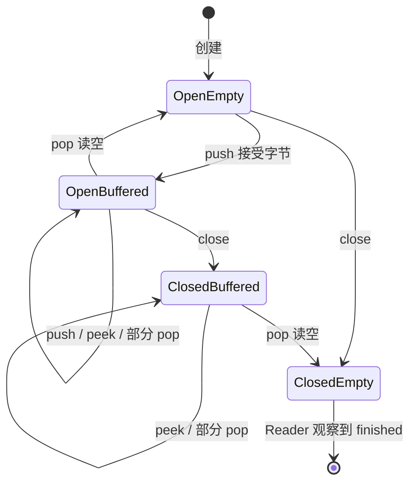

# 第 11 课：数据写得太快怎么办——有限容量字节流

> [!info] 本课位置
> [[10_端口与UDP|第 10 课]]研究的是“怎样把一份有边界的数据报交给正确套接字”。现在开始走向 TCP：TCP 不向应用交付一份份消息，而是提供一条**可靠、有序的字节流**。在研究“可靠”和“有序”怎样实现以前，我们先把“字节流本身”造清楚。

预计用时：正文与推演 90～120 分钟；C++ 接口阅读 20～30 分钟；检查站 20～30 分钟。

> [!note] 复习队列
> 第 9 课和 Lab 1 在 2026-09-09 到期的复习仍保留在 [[复习计划]] 中。本次已经明确选择继续新课，因此不在这里打断主线。

---

## 学习目标

本课结束后，你应该能够：

1. 用例子说明 UDP 数据报与 TCP 字节流的根本区别；
2. 解释为什么字节流缓冲区必须有容量上限；
3. 区分容量、当前缓冲字节数、累计写入量和累计读取量；
4. 推导并使用字节流的两个核心不变量；
5. 区分“暂时没有数据”和“以后永远不会再有数据”；
6. 解释 `push`、`peek`、`pop`、`close`、`is_finished` 的职责；
7. 手工推演一个有限容量字节流的状态变化；
8. 看懂下一次 Lab 将要使用的最小 C++ 接口。

---

## 0. 从上一课留下的问题开始

UDP 会保留数据报边界。应用连续发送两次：

```text
send(D1 = "ABC")
send(D2 = "DE")
```

如果两份 UDP 数据报都到达，接收方仍能看见两份独立的数据报：

```text
D1 = "ABC"
D2 = "DE"
```

现在设想另一种服务。发送方仍然先写入 `ABC`，再写入 `DE`，接收方却可能这样读取：

```text
第一次读到："A"
第二次读到："BCD"
第三次读到："E"
```

所有字节都在，顺序也是 `ABCDE`，但原来的两次写入边界已经看不见了。

这不是网络把数据弄坏了，而是服务本来就承诺：

> 我会给你一条按顺序排列的字节流，但不替你记住应用调用了几次 `write`。

TCP 向应用提供的正是这种抽象。

本课暂时不问 TCP 怎样重传丢失数据，也不问数据怎样经过 IP。我们先在一台电脑里造出最小模型：

```text
写入者 → [有限容量缓冲区] → 读取者
```

这个模型本身不是网络协议，也不会发送 Ethernet 帧。它是一块可以单独理解和测试的地基。

这里的**缓冲区（buffer）**只是程序管理的一段内存，用来暂时保存“Writer 已经交来、Reader 还没取走”的字节。它不是路由器的接口，也不是网络中另外一台设备。

---

## 1. 什么是字节流

字节流可以先理解成一条有先后顺序的字节序列：

```text
字节 0, 字节 1, 字节 2, 字节 3, ...
```

写入者不断把字节追加到尾部；读取者只能从头部按顺序取走字节。

```text
                   追加到尾部
                       ↓
已经读走 ← [ A ][ B ][ C ][ D ] ← 新字节
             ↑
          从头部读取
```

### 字节不等于可见字符

为了便于画图，本课经常用 `A`、`B`、`C` 表示字节。但真实字节可以是 `0x00`～`0xFF` 的任意值，可能是：

- UTF-8 文本的一部分；
- 整数或浮点数序列化后的内容；
- 图片、音频或压缩数据；
- 应用协议自己定义的字段。

C++ 的 `std::string` 虽然名字叫“字符串”，实际上也能保存值为 `0` 的字节；不能因为中间出现 `\0` 就用只面向 C 风格字符串的函数猜长度。

### 流没有应用消息边界

假设写入者调用：

```text
push("Jump")
push("Left")
```

从字节流自己的角度，它只保存：

```text
JumpLeft
```

读取者不能仅靠这条流判断它原来是：

```text
"Jump" + "Left"
```

还是：

```text
"Ju" + "mpLe" + "ft"
```

甚至可能本来就是一次写入：

```text
"JumpLeft"
```

如果应用需要恢复消息边界，应用协议必须自己增加规则，例如固定长度、分隔符或长度前缀。这个问题以后会专门展开。

---

## 2. 写入者和读取者不一定是两台电脑

为了避免角色混乱，先定义两个词：

- **写入者（writer / producer）**：产生字节，并尝试把它们放入流；
- **读取者（reader / consumer）**：观察并消耗流头部的字节。

它们可能是：

- 同一进程中的两个组件；
- 同一进程中的两个线程；
- TCP 接收端与应用程序之间的两侧；
- 应用程序与 TCP 发送端之间的两侧。

本课的图只是抽象角色：

```text
Writer → ByteStream → Reader
```

不要自动把 Writer 理解成远端客户端、Reader 理解成本机服务器。网络两端都可能各自拥有读写方向的缓冲区。

### 为什么要把两个角色分开

Writer 需要的能力是：

```text
还有多少空间？
能写入多少字节？
以后是否还会继续写？
```

Reader 需要的能力是：

```text
现在有哪些字节可以看？
我要消耗多少字节？
字节流是否真的结束了？
```

把角色分开后，每一侧只看见自己需要的操作，更不容易错误地清空或改写另一侧的状态。

---

## 3. 第一个朴素方案：无限大的缓冲区

最容易想到的实现是：Writer 写多少，我们就在内存里存多少；Reader 有空再读。

```text
Writer ──不断写──> [      无限增长的内存      ] ──> Reader
```

但物理内存不可能无限。

假设 Writer 每秒写入 `100 MB`，Reader 每秒只能处理 `20 MB`：

```text
每秒净增加 = 100 - 20 = 80 MB
```

十分钟以后，未读数据大约增加：

```text
80 MB/s × 600 s = 48,000 MB ≈ 48 GB
```

Reader 即使没有彻底停止，只要长期比 Writer 慢，缓存仍会一直长大，最后可能拖垮整个进程或系统。

因此最小修正是：

> 缓冲区必须有一个明确的最大容量；满了以后，Writer 不能继续假装所有数据都已被接收。

这就是**有限容量字节流**。

---

## 4. 容量限制的到底是什么

假设字节流容量为 `5` 字节。

这里的容量限制的是：

> 当前已经写入、但还没有被 Reader 消耗的字节数。

它不限制这条流一生最多只能传 5 字节。

例如：

```text
容量 = 5

Writer 写入 ABCDE   → 缓冲 5 字节，满
Reader 读走 ABC     → 缓冲剩 DE，可用空间恢复为 3
Writer 再写入 FGH   → 缓冲变成 DEFGH，再次满
```

这条流累计已经接受 `8` 字节，但任何时刻最多只缓存 `5` 字节。

### 三个容易混淆的量

| 名称 | 含义 | 会不会减少 |
| --- | --- | --- |
| `capacity` | 缓冲区最多同时容纳多少未读字节 | 通常创建后不变 |
| `bytes_buffered` | 当前还没被 Reader 消耗的字节数 | 会增加也会减少 |
| `bytes_pushed` | 从创建以来累计被流接受的字节数 | 只增加 |
| `bytes_popped` | 从创建以来累计被 Reader 消耗的字节数 | 只增加 |

注意：表中其实列了四个量。`capacity` 是限制，后三个是状态或计数。

---

## 5. 两个核心不变量

“不变量”是指无论经历多少合法操作，都应该一直成立的关系。它不是某一时刻碰巧相等，而是实现正确性的骨架。

### 不变量一：未读字节来自累计写入与累计读出的差

```text
bytes_buffered = bytes_pushed - bytes_popped
```

例如累计写入 `12` 字节，累计读走 `7` 字节，那么当前必然还有：

```text
12 - 7 = 5 字节
```

如果你的容器里只有 4 字节，说明至少有一个地方丢了数据或计数错误。

### 不变量二：可用容量来自总容量与当前缓冲量的差

```text
available_capacity = capacity - bytes_buffered
```

并且合法状态必须满足：

```text
0 ≤ bytes_buffered ≤ capacity
```

这几个关系可以连起来：

```text
available_capacity
  = capacity - bytes_buffered
  = capacity - (bytes_pushed - bytes_popped)
```

> [!tip] 调试价值
> 通过测试不一定能立刻告诉你错在哪里；不变量能。每次 `push` 或 `pop` 后检查它们，经常能迅速发现“计数加了但数据没进容器”“容器删了但累计读取没更新”一类错误。

---

## 6. 缓冲区满了，Writer 应该怎样知道

缓冲区满时至少有三种接口设计：

### 设计 A：悄悄丢掉装不下的字节

危险在于 Writer 可能以为全部写入成功，导致无声的数据损坏。

### 设计 B：一直阻塞，直到出现空间

这在某些阻塞式接口中是合理选择，但会让调用线程停在那里。我们的第一版模型希望一次函数调用立即返回，便于手工推演和测试。

### 设计 C：只接受能装下的部分，并返回实际数量

本课程的 TinyStream 选择这个契约：

```cpp
std::size_t push(std::string_view data);
```

返回值表示本次真正接受了多少字节。

例如容量为 5，当前已有 3 字节：

```text
available_capacity = 5 - 3 = 2
push("WXYZ")
```

只能接受前两个字节 `WX`，返回 `2`。剩余的 `YZ` 仍属于调用者，调用者必须以后重试或采用其他策略。

这使“现在写不下”变成了接口中可观察的事实。

---

## 7. 背压：下游变慢，压力向上游传回去

当 Reader 处理变慢，缓冲区逐渐变满；可用容量下降；Writer 的 `push` 只能接受更少字节，甚至返回 0。

```text
Reader 变慢
   ↓
缓冲区积压
   ↓
available_capacity 变小
   ↓
Writer 不能继续全速写入
```

这种“下游没有空间”的信号向上游传播，叫作**背压（backpressure）**。

背压不是某一个固定函数名，而是一种系统行为：生产者必须能知道消费者暂时跟不上，并相应减速、等待或保存尚未提交的数据。

### 背压不是丢包恢复

背压解决的是：

```text
接收或消费速度跟不上时，不让本地缓冲无限增长
```

它还没有解决：

```text
网络中的数据丢了，怎样发现和重传
```

### 背压也不等于拥塞控制

先留下一个边界：

- 背压/流量控制主要关心消费者或接收方能不能接得住；
- 拥塞控制主要关心共享网络能不能承受所有发送者的流量。

两者都会让发送者减速，但原因不同。后续课程会逐步把这两个问题分开。

---

## 8. `peek` 与 `pop` 为什么分成两个操作

Reader 常需要先查看流头部的数据，再决定实际消耗多少。

我们定义：

```text
peek(max_len)：查看最多 max_len 个开头字节，不删除
pop(len)：从开头消耗 len 个字节
```

假设缓冲区是：

```text
ABCDE
```

调用：

```text
peek(3) → "ABC"
```

缓冲区仍然是：

```text
ABCDE
```

随后：

```text
pop(2)
```

缓冲区才变成：

```text
CDE
```

### 为什么不是看一次就自动删除

应用可能需要：

1. 先查看消息头是否完整；
2. 从消息头读出整条消息长度；
3. 如果正文还没到齐，就暂时不消费；
4. 全部到齐后再一次性 `pop`。

把“看”和“消耗”分开，调用者能明确控制数据什么时候真正离开缓冲区。

### `read` 可以是组合操作

一个便利的 `read(n)` 可以理解为：

```text
result = peek(n)
pop(result.size())
return result
```

但 Lab 会先保留 `peek` 和 `pop` 两个基础动作，因为它们更容易暴露状态变化。

---

## 9. 暂时为空，不等于永久结束

这是字节流里最重要的状态区别之一。

考虑两个场景。

### 场景一：现在为空，但 Writer 还可能继续写

```text
缓冲区 = 空
Writer = 仍然开放
```

Reader 现在读不到数据，但稍后可能有新字节到来。它应该等待或稍后再试，不能宣布流结束。

### 场景二：现在为空，而且 Writer 已关闭

```text
缓冲区 = 空
Writer = 已关闭
```

Writer 已明确表示以后不会再写入，缓冲区也已读空。此时 Reader 才能确定到达了流末尾，也就是 EOF（end of file / stream）。

因此：

```text
is_finished = is_closed && bytes_buffered == 0
```

只看 `bytes_buffered == 0` 不够。

---

## 10. `close` 到底做什么

Writer 调用 `close()` 的含义是：

> 我以后不会再向这条流写入新字节。

它不表示：

- 清空仍未读取的数据；
- 立刻让 Reader 看见 finished；
- 撤销以前成功写入的字节；
- 发生了错误。

假设缓冲区还有 `XYZ`：

```text
close()
```

之后的正确状态是：

```text
Writer 已关闭
缓冲区仍是 XYZ
Reader 仍可读取 XYZ
```

只有 Reader 把 `XYZ` 全部消耗后：

```text
is_finished == true
```

### 关闭后还能重新打开吗

我们的最小模型不允许。`close` 是单向状态变化：

```text
open → closed
```

不能从 `closed` 回到 `open`。

关闭后再次 `push` 不应接受新字节。本课程接口让它返回 `0`。

---

## 11. 四种状态放在一起

| Writer 状态 | 缓冲区 | Reader 现在能读吗 | 以后可能有新字节吗 | `is_finished` |
| --- | --- | --- | --- | --- |
| 开放 | 非空 | 能 | 能 | `false` |
| 开放 | 空 | 不能，暂时等待 | 能 | `false` |
| 关闭 | 非空 | 能，先读完剩余字节 | 不能 | `false` |
| 关闭 | 空 | 不能 | 不能 | `true` |

> [!question] 想一想
> 为什么“关闭且非空”不能算 finished？

因为已经被流接受的数据仍属于 Reader，若过早报告结束，就会把缓冲区尾部的数据无声丢掉。

---

## 12. 完整状态推演：容量为 5

设：

```text
capacity = 5
```

我们的接口允许部分写入，`pop(n)` 返回实际消耗的字节数。

| 步骤 | 操作 | 返回/观察 | 缓冲区 | pushed | popped | 可用容量 | closed | finished |
| ---: | --- | --- | --- | ---: | ---: | ---: | --- | --- |
| 0 | 创建 | — | 空 | 0 | 0 | 5 | 否 | 否 |
| 1 | `push("ABCD")` | 接受 4 | `ABCD` | 4 | 0 | 1 | 否 | 否 |
| 2 | `peek(2)` | `AB` | `ABCD` | 4 | 0 | 1 | 否 | 否 |
| 3 | `pop(2)` | 消耗 2 | `CD` | 4 | 2 | 3 | 否 | 否 |
| 4 | `push("EFGH")` | 接受 3 | `CDEFG` | 7 | 2 | 0 | 否 | 否 |
| 5 | `close()` | — | `CDEFG` | 7 | 2 | 0 | 是 | 否 |
| 6 | `pop(4)` | 消耗 4 | `G` | 7 | 6 | 4 | 是 | 否 |
| 7 | `pop(10)` | 实际消耗 1 | 空 | 7 | 7 | 5 | 是 | 是 |

这里有几个关键观察。

### `peek` 不改变任何计数

第 2 步只是观察，没有消费，所以缓冲区、`pushed` 和 `popped` 都不变。

### 第 4 步不是接受 4 字节

当时只有 3 字节空间，所以只接受 `EFG`。字节 `H` 没有进入流，累计写入量只从 4 变为 7。

### `close` 不清空数据

第 5 步以后 Reader 仍必须读完 `CDEFG`。

### 超量 `pop` 的契约必须明确

我们的 TinyStream 把 `pop(10)` 定义为最多消耗现有字节，返回实际数量 `1`。另一套库也可能把超量 `pop` 定义为调用错误。

重点不是哪种设计宇宙唯一正确，而是：**接口必须说清楚，调用者与实现必须遵守同一契约。**

---

## 13. 一张状态图



这张图没有画错误状态，也没有画多线程竞争。第一版 Lab 是单线程模型；不要自行添加锁、条件变量或异步回调。

---

## 14. 错误与正常结束不是一回事

正常关闭表示：

```text
Writer 按计划写完了，不会再有新数据
```

错误表示：

```text
某个异常条件使这条流不能再按正常契约工作
```

例如底层连接异常终止时，上层可能既需要知道“没有更多字节”，也需要知道“不是正常结束”。

在下一版接口中，我们可能加入：

```cpp
void set_error();
bool has_error() const;
```

但它们不会替代 `close`、`bytes_buffered` 或计数器。为了先把核心状态造稳，本课检查站只考正常关闭；错误状态暂时知道边界即可。

---

## 15. 必须读懂：最小 C++ 接口

下面是下一次 Lab 的概念接口。实现可能微调，但每个函数的职责不会突然改变。

```cpp
#pragma once

#include <cstddef>
#include <cstdint>
#include <deque>
#include <string>
#include <string_view>

class ByteStream {
public:
    /// <summary>
    /// 创建最多保存 capacity 个未读字节的流。
    /// </summary>
    explicit ByteStream(std::size_t capacity);

    /// <summary>
    /// 尽量把 data 追加到流尾部，返回实际接受的字节数。
    /// 已关闭时返回 0。
    /// </summary>
    std::size_t push(std::string_view data);

    /// <summary>
    /// 返回开头最多 max_len 个字节的副本，不消耗数据。
    /// </summary>
    [[nodiscard]] std::string peek(std::size_t max_len) const;

    /// <summary>
    /// 从流头部最多消耗 len 个字节，返回实际消耗量。
    /// </summary>
    std::size_t pop(std::size_t len);

    /// <summary>
    /// 声明以后不会再写入新字节，但保留尚未读取的数据。
    /// </summary>
    void close();

    [[nodiscard]] bool is_closed() const;
    [[nodiscard]] bool is_finished() const;
    [[nodiscard]] std::size_t bytes_buffered() const;
    [[nodiscard]] std::size_t available_capacity() const;
    [[nodiscard]] std::uint64_t bytes_pushed() const;
    [[nodiscard]] std::uint64_t bytes_popped() const;

private:
    std::size_t capacity_;
    std::deque<char> buffer_;
    std::uint64_t bytes_pushed_ { 0 };
    std::uint64_t bytes_popped_ { 0 };
    bool closed_ { false };
};
```

### 为什么累计计数用 `uint64_t`

缓冲区可能只有几 KB，但一条长连接一生累计传输的数据可能远大于当前容量。累计计数只增加，使用更宽的无符号整数能延后溢出。

这不表示容量也必须大到 `uint64_t`；容量仍受本机可分配内存和容器大小限制。

代码里的 `[[nodiscard]]` 只是给编译器的提示：调用者最好不要无意中忽略这个返回值。它不改变字节流的网络语义，也不是本课需要记忆的协议字段。

### 为什么这里用 `std::deque<char>`

我们经常在尾部追加、从头部删除。`std::deque` 对这两个方向的操作都比较直接。

如果使用一个 `std::string` 并反复执行：

```cpp
buffer.erase(0, n);
```

剩余字符可能需要整体向前移动。小数据也能工作，但它掩盖了“从头部消费”应当高效这一要求。

### `std::string_view` 只借用输入

可以先把 `std::string_view` 想成“原数据的位置加长度”：它只提供一扇观察现有字符的窗口，本身不拥有那些字节。

所以 `push(std::string_view data)` 必须在函数返回前把接受的字节复制到自己的 `buffer_` 中，不能把 view 保存起来等待以后使用，否则调用者原数据失效后会留下悬空引用。

---

## 16. 暂时可视为黑箱：更高效的环形缓冲区

真实高性能实现可能预先分配一块固定数组，并维护读位置和写位置：

```text
[ G ][ H ][ _ ][ _ ][ D ][ E ][ F ]
          ↑           ↑
        write       read
```

写位置走到数组末尾后绕回开头，因此叫环形缓冲区。

它能减少小对象分配，也能更连续地使用内存，但会引入：

- 读写位置绕回；
- 数据分成数组尾部和头部两段；
- “读写位置相同”究竟表示空还是满；
- 更多边界条件。

下一次 Lab 的目标是掌握字节流契约和不变量，不是考环形下标。先用 `std::deque<char>` 写对，再讨论优化。

---

## 17. 它以后怎样接进 TCP

先只看方向，不要求知道 TCP 内部细节。

### 发送方向

```text
应用写入字节
  ↓
出站 ByteStream
  ↓
TCP 发送端取走一部分字节，装进 TCP 报文段
  ↓
IP 数据报与网络
```

### 接收方向

```text
网络送来 TCP 报文段
  ↓
TCP 接收端检查顺序并重组
  ↓
把连续可交付的字节写入入站 ByteStream
  ↓
应用按自己的速度读取
```

有限容量在这里开始发挥作用：如果应用长期不读，入站 ByteStream 会变满，接收方就必须表达“我现在接不下更多数据”。这会引出 TCP 的流量控制。

但现在不要把结论跳得太远。我们还没造出乱序重组器，也没定义确认和窗口字段。当前只需确保地基的状态不会自相矛盾。

---

## 18. 与 C# / Unity 的最小联系

C# 的 `NetworkStream` 代表流式读写。假设发送方执行：

```csharp
await stream.WriteAsync(messageA);
await stream.WriteAsync(messageB);
```

接收方的一次 `ReadAsync` 不保证恰好返回 `messageA`，下一次也不保证恰好返回 `messageB`。它可能只返回当前已经可用的一部分字节，也可能一次读到两条应用消息拼在一起的内容。

因此 TCP 游戏协议不能写成：

```text
一次 Write = 对方一次 Read = 一条完整消息
```

应用需要自己的消息边界规则。例如长度前缀：

```text
[4 字节长度][消息正文][4 字节长度][下一条消息正文]...
```

本课不要求实现这个协议；这里只是让“字节流不保留写入边界”落到以后真实 API 会遇到的问题上。

---

## 19. 常见误区

### 误区一：容量为 8，就只能累计传 8 字节

容量只限制同时缓存的未读字节。Reader 读走后，空间可以反复使用。

### 误区二：`peek` 已经把数据拿出来了，所以计数应该减少

`peek` 只是观察。只有 `pop` 才消费数据并增加 `bytes_popped`。

### 误区三：缓冲区空了，所以流结束

Writer 仍开放时，稍后可能继续写。必须同时满足“Writer 已关闭”和“缓冲区为空”。

### 误区四：`close` 应该清空缓冲区

`close` 只关闭未来写入。以前已接受但未读取的数据仍必须保留。

### 误区五：`push` 返回成功就表示 Reader 已处理

它只表示字节流接受了相应数量的字节。数据可能仍在缓冲区中，Reader 尚未观察。

### 误区六：TCP 的一次发送对应一次接收

TCP 提供连续字节流，不保留应用写入边界。消息划分属于应用协议。

---

## 20. 本课最小心智模型

```text
Writer
  │ push：尽量写，返回实际接受量
  ▼
[ 未读字节，最多 capacity 个 ]
  │ peek：只看
  │ pop：真正消耗
  ▼
Reader
```

五条骨架：

1. 字节流只有顺序，没有应用消息边界；
2. 容量限制当前未读字节，不限制累计传输量；
3. `bytes_buffered = bytes_pushed - bytes_popped`；
4. `available_capacity = capacity - bytes_buffered`；
5. `is_finished = is_closed && bytes_buffered == 0`。

---

## 检查站

请先滚动到看不到正文的位置，再用自己的话回答。可以直接写在本文件题目下；不知道可以明确写“不知道”。

1. 应用先后执行 `push("ABC")` 和 `push("DE")`。为什么 Reader 不能根据字节流本身确定原来有两次写入？这与 UDP 数据报有什么不同？

2. 一个字节流容量为 `6`，当前缓冲区是 `ABC`。此时：

   - `bytes_buffered` 是多少？
   - `available_capacity` 是多少？
   - 调用 `push("DEFGH")` 最多接受几个字节，接受哪些字节？

3. 某时刻 `bytes_pushed=20`、`bytes_popped=13`，容量为 `10`。计算 `bytes_buffered` 和 `available_capacity`。如果容器实际只保存了 6 字节，说明什么？

4. 分别用一句话说明 `peek` 和 `pop`。缓冲区为 `ABCDE` 时，依次执行 `peek(3)`、`pop(2)`，两次操作后缓冲区各是什么？

5. 对下面四种状态，分别判断 `is_finished`：

   ```text
   A. Writer 开放，缓冲区为空
   B. Writer 开放，缓冲区非空
   C. Writer 关闭，缓冲区非空
   D. Writer 关闭，缓冲区为空
   ```

6. Writer 在缓冲区仍有 `XYZ` 时调用 `close()`。这三个字节应不应该被清空？Reader 什么时候才能判断流真正结束？关闭后再次 `push("A")`，按本课契约接受多少字节？

7. 容量为 `5`，初始为空。依次执行：

   ```text
   push("ABC")
   pop(1)
   push("DEFG")
   close()
   pop(10)
   ```

   对每一步写出缓冲区内容；两次 `push` 分别接受多少字节？最后的 `bytes_pushed`、`bytes_popped` 和 `is_finished` 是什么？

8. “缓冲区满了，`push` 只能接受一部分”怎样把 Reader 变慢的事实传回 Writer？为什么这叫背压？它是否已经解决网络丢包和重传？

9. 本课程的第一版 Lab 选择 `std::deque<char>`，而不是直接实现环形缓冲区。请分开回答：

   - `deque` 的哪两个操作正好对应“从尾部写入、从头部读取”？
   - 环形缓冲区为什么可能更高效？它额外引入了哪些边界状态或下标问题？
   - `std::string_view` 为什么不能直接保存到对象里长期使用？

10. C# 发送方连续两次 `WriteAsync`，分别写一条登录消息和一条移动消息。接收方为什么不能假设两次 `ReadAsync` 会分别得到完整的两条消息？应用协议至少可以增加哪一类规则来恢复消息边界？

附加辨析：

```text
解封装、解复用、从字节流中 pop
```

这三个动作分别改变或决定什么？它们为什么不是同一件事？

---

## 下一步

检查站通过后，将进入 Lab 2：TinyStream。

你会亲手实现本课接口，并用测试观察：

- 部分写入；
- `peek` 不消费；
- `pop` 释放容量；
- 关闭后仍能排空；
- 空但开放与空且关闭；
- 两个不变量在长操作序列中始终成立。

Lab 的公共函数会附带必要的 XML 风格注释；不要求单独写实验报告，测试结果与代码中的必要解释就是主要证据。

---

## 你的检查站答案与反馈

### 1. 字节流与 UDP

> 因为tcp把这些数据报看成一整个字节流，只管所有数据是否排列有序，UDP把数据报看成单独的个体，不管整体的顺序

主线正确。更准确地说，TCP 接收的是连续字节，不知道发送方调用了几次写入；UDP 每份数据报保留自己的边界，但 UDP 本身不保证这些数据报整体有序。

### 2. 容量与部分写入

> `bytes_buffered=3`，`available_capacity=3`，最多接受 `DEF`

全部正确。容量为 6、已有 3 字节时只剩 3 个位置。

### 3. 不变量

> `7`、`3`；如果容器实际只保存 6 字节，说明出故障了？

数值正确：`bytes_buffered=20-13=7`，`available_capacity=10-7=3`。容器只保存 6 字节说明实现状态不一致：计数器与实际缓冲内容违反 `bytes_buffered = bytes_pushed - bytes_popped`，应检查数据入队、出队或计数更新。

### 4. `peek` 与 `pop`

> 看和销毁；`ABCDE`，`ABC`

结果正确，术语需要换精确：`peek` 是查看、不修改；`pop` 是从头部**消耗**，不是销毁整个对象。`peek(3)` 后仍是 `ABCDE`，`pop(2)` 后才是 `CDE`。

### 5. 四种结束状态

> 只有 D 完成

正确。必须同时满足 Writer 已关闭且缓冲区为空。

### 6. `close` 语义

> 不会清空；缓冲区空、Writer 关；不接受

正确。关闭只禁止未来写入，不清空 `XYZ`；排空后才 finished；关闭后再次 push 接受 0 字节。

### 7. 连续状态追踪

> `abc,ab,abdef,abdef,null`；`3,2`；`6,6`；`true`

最后的累计计数和 finished 结果对了，但中间状态和第二次 push 的接受量错了。按本课契约逐步追踪：

```text
push("ABC") → 缓冲 ABC，接受 3
pop(1)       → 缓冲 BC，实际消耗 1
push("DEFG") → 只剩 3 个位置，接受 DEF，缓冲 BCDEF
close()      → 仍是 BCDEF，不清空
pop(10)      → 实际消耗 5，缓冲为空，finished=true
```

所以最后是 `bytes_pushed=6`、`bytes_popped=6`，但第二次 push 接受 3 而不是 2。这个问题需要做一次新的状态迁移题确认。

### 8. 背压

> 下游读取变慢让压力信号传导到上游；不解决丢包

正确。缓冲区变满使 `push` 返回更少的接受量，Writer 因此知道 Reader 暂时跟不上；这限制的是本地积压，不是网络丢包恢复。

### 9. 容器选择与题目反馈

> 前可取，后可加；环形进阶；`string_view` 相当于一种特殊的部分引用可能导致悬空

你的方向基本正确，而且“这个问题是不是有点不太行”的反馈成立。原题把两个独立理由挤在了一句里，容易只留下“前可取，后可加”。现在已改成三个分问：`deque` 直接支持尾部追加和头部移除；环形缓冲区可能更高效，但需要处理绕回、空/满等边界；`string_view` 只借用位置和长度，保存太久可能悬空。

### 10. TCP 消息边界

> TCP 把他们当成完整的流，不管边界；自定义读取规则，UDP

第一句和“自定义读取规则”正确。长度前缀、分隔符或固定长度都可以恢复应用消息边界。UDP 不是 TCP 流的“读取规则”，它是另一种传输服务：UDP 天然保留数据报边界，但同时放弃 TCP 的可靠有序字节流保证。

### 附加辨析

> 解封装是逐层拆掉层包装；解复用是传输层决定把应用数据交给谁；pop 是缓冲区取数据

基本正确。再精确一点：解复用不只发生在传输层，EtherType、IP Protocol、UDP 目标端口都可能参与不同级别的选择；`pop` 只是已经进入字节流后的本地消费。

> [!summary] 当前判断：基本掌握，等待一次状态迁移复测
> 你已经理解有限容量、背压、关闭语义、两个不变量和 TCP 字节流边界。唯一尚未稳定的是长操作序列中的逐步记账。请完成下面这一题；通过后即可开放 TinyStream Lab。

### 必做复测

容量为 `4`，初始为空。依次执行：

```text
push("WXYZ")
pop(2)
push("123")
close()
pop(99)
```

请写出每一步之后的缓冲区内容、两次 `push` 的实际接受量、最后的 `bytes_pushed`、`bytes_popped` 和 `is_finished`。
