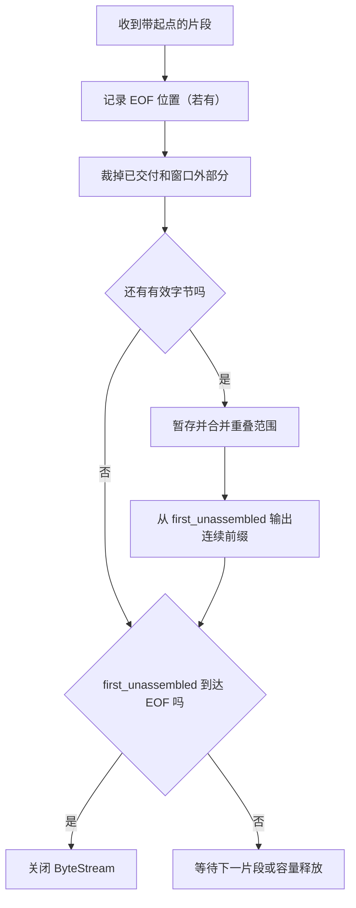

# 第 12 课：数据到了，但顺序乱了——乱序子串重组器

> 预计时间：2.2–3 小时
>
> 前置：[[11_有限容量字节流|第 11 课：有限容量字节流]]、[[Labs/Lab2_TinyStream/README|Lab 2：TinyStream]]
>
> CS144 对应：TCP 接收端之前的 Reassembler / Lab 1 的核心思想。

> [!tip] 交互演示
> [打开“乱序子串重组器”](12_乱序子串重组_交互.html)，点击“到达下一片段”，边读边观察空洞、重叠、`first_unassembled` 和接收端 ByteStream 的变化。

这一课暂时不写 Lab。我们先把一个经常被一句“TCP 会重排”带过的问题拆开：

> 网络把一条连续的字节流切成许多带位置的片段；片段可能乱序、重叠、重复、缺失。接收端怎样把它们重新变成一条只向前增长的字节流？

上一课已经有了一个有限容量的字节流：

```text
Writer → [按顺序保存的未读字节] → Reader
```

现在我们在它前面加一个组件：

```text
网络片段 → Reassembler（重组器）→ ByteStream → 应用
```

重组器不是另一个“更大的字符串”。它是一个知道**每段字节应该位于整条流的哪个位置**，并且只把连续前缀交给 ByteStream 的状态机。

---

## 1. 本课结束时要能做什么

合上正文后，你应该能：

1. 说明 ByteStream 和 Reassembler 分别解决什么问题；
2. 用半开区间 `[起点, 终点)` 表示一个片段覆盖的字节位置；
3. 手工追踪乱序片段、重叠片段和重复片段；
4. 解释为什么有空洞时不能把后面的片段直接写入 ByteStream；
5. 说出 `first_unassembled`、待重组片段和 EOF 位置各自表示什么；
6. 解释容量限制为什么会变成一个可接受窗口；
7. 判断什么时候可以关闭输出流，为什么收到“最后一段”不等于现在就结束；
8. 把重组器和上一课的 `push`、`peek`、`pop`、`close` 接起来。

本课不要求你记住某个 C++ 容器。先把数据模型和状态变化讲清楚，下一课再把它变成代码。

---

## 2. 先回到上一课：ByteStream 的能力边界

上一课的 `ByteStream` 很简单。Writer 只能把新字节接在尾部，Reader 只能从头部读取：

```text
push("ABC") → ABC
push("DE")  → ABCDE
pop(2)      → CDE
```

它有一个重要前提：**Writer 已经知道输入字节的正确顺序**。

但网络收到的东西通常不是“下一段恰好接在末尾”：

```text
发送方的完整流： A B C D E F G H

网络先到：       E F G H
网络后到：       A B C D
```

如果接收端的重组器不看片段位置，只按到达顺序把片段写入**接收端自己的 ByteStream**：

```cpp
receiver_output.push("EFGH");
receiver_output.push("ABCD");
```

得到的会是 `EFGHABCD`，而不是原来的 `ABCDEFGH`。ByteStream 没有做错；它只按照收到的顺序工作。缺少的是一个在它前面查看“位置”的组件。

这里的 `push` 不是“把数据发到网络”的发送调用，而是接收端内部的本地写入：

```text
发送端：应用 → 发送端 ByteStream → 网络
接收端：网络 → Reassembler → 接收端 ByteStream（这里调用 push）→ 应用
```

两端都可以各自拥有 ByteStream，但它们属于不同方向、不同进程中的对象；本课讨论的是右侧的接收方向。

### 先预测

如果片段带有“这段数据从整条流的第几个字节开始”的信息，那么接收端最少还需要保存什么？

不要急着回答“一个数组”。先想：如果第 5 个字节先到，而第 0 个字节还没到，接收端能不能把第 5 个字节交给应用？

---

## 3. 给每个字节一个位置

为了重组，不能只收到一个字符串，还要收到它在整条流中的起点。

把一次到达抽象成：

```text
(first_index, data, is_last_substring)
```

例如：

```text
(5, "WORLD", false)
```

表示这 5 个字节要放在整条流的第 5～9 号位置。

我们从 0 开始编号：

```text
完整流：  H E L L O W O R L D
位置：    0 1 2 3 4 5 6 7 8 9
片段：              W O R L D
                      5 6 7 8 9
```

### 3.1 半开区间 `[start, end)`

一个长度为 `n`、起点为 `start` 的片段覆盖：

```text
[start, start + n)
```

右端点不包含在片段里。比如：

```text
(5, "WORLD") → [5, 10)
```

它覆盖 `5、6、7、8、9`，不覆盖 `10`。

半开区间有三个好处：

- 长度永远是 `end - start`；
- 两段首尾相接时，`[0,5)` 和 `[5,10)` 中间没有空洞；
- 空片段可以表示为 `[n,n)`，不会制造一个奇怪的字节。

### 3.2 位置不是数组下标

这里的 `first_index` 是**整条 TCP 字节流的逻辑位置**，不是当前 `std::deque` 的下标。

当 Reader `pop` 掉前面的字节时，逻辑位置仍然继续增长：

```text
已经交给输出： A B C
当前输出队列： D E
下一期待重组位置：5
```

不能因为内存里的第一个元素现在位于容器下标 0，就把它重新编号成流位置 0。容器下标会移动，流位置不会倒退。

---

## 4. 第一个必须维护的状态：`first_unassembled`

重组器最重要的问题不是“我收到了哪些片段”，而是：

> 当前最小的、还没有连续交给输出流的位置是多少？

把它叫作：

```text
first_unassembled
```

如果 `first_unassembled = 0`，说明位置 0 还没交付；如果它是 5，说明位置 0～4 已经连续交付，下一字节必须是位置 5。

它与上一课的计数有直接关系：

```text
first_unassembled = output.bytes_pushed()
```

在我们从 0 开始编号、输出流只接受按顺序字节的模型中，输出流累计接受了多少字节，就说明前面多少个流位置已经被重组并交给它。

注意这和 `output.bytes_popped()` 不一样：

- `bytes_pushed()`：这些字节已经被重组器交给 ByteStream；
- `bytes_popped()`：应用已经从 ByteStream 读走多少字节；
- `first_unassembled`：下一块还需要从哪个逻辑位置开始。

应用读得快慢会改变缓冲区占用，但不会让 `first_unassembled` 倒退。

---

## 5. 第一个具体问题：片段乱序到达

假设完整流是 `HELLOWORLD`，网络分成两段：

```text
片段 A：起点 0，内容 "HELLO"，覆盖 [0,5)
片段 B：起点 5，内容 "WORLD"，覆盖 [5,10)
```

但到达顺序是 B、A。

### 5.1 先收到 B

此时：

```text
first_unassembled = 0
已知片段 = [5,10)
输出流 = 空
```

位置 0 仍然缺失，所以不能把 `WORLD` 写入输出。正确动作是：

```text
把 [5,10) 暂存在待重组区域
first_unassembled 仍为 0
输出流仍为空
```

如果此时把 `WORLD` 交给应用，就相当于改变了应用看到的字节顺序。

### 5.2 再收到 A

收到 `[0,5)` 后，已知范围变成：

```text
[0,5) + [5,10) = [0,10)
```

从 `first_unassembled=0` 开始，所有位置都连续，因此可以一次或分两次写入：

```text
输出：HELLO，再输出 WORLD
first_unassembled：0 → 5 → 10
```

最终 ByteStream 看到的仍然是 `HELLOWORLD`，完全不关心网络内部先送到了哪一段。

### 5.3 这里新增的责任

ByteStream 负责：

```text
按调用顺序保存和消费字节
```

Reassembler 负责：

```text
根据逻辑位置决定哪些字节现在可以按顺序交给 ByteStream
```

这就是分层/分组件的意义：不让 ByteStream 同时承担网络乱序处理。

---

## 6. 第二个问题：中间有空洞

现在收到三个片段：

```text
[0,2)  = "AB"
[4,6)  = "EF"
[2,4)  = "CD"
```

按顺序分析前两次：

### 收到 `[0,2)`

```text
first_unassembled = 0
输出：AB
first_unassembled = 2
```

### 收到 `[4,6)`

```text
位置 2、3 还缺失
输出仍然是 AB
暂存 EF
first_unassembled 仍为 2
```

### 收到 `[2,4)`

现在 `[2,4)` 接上了当前缺口，而且后面已经有 `[4,6)`：

```text
[2,4) + [4,6) = [2,6)
```

于是连续输出：

```text
CD，再输出 EF
first_unassembled：2 → 4 → 6
```

结果是 `ABCDEF`。

### 为什么不能只看“有没有数据”

收到 `[4,6)` 并不代表“已经有足够数据可以输出”。关键问题是：

```text
当前 first_unassembled=2
下一个片段却从 4 开始
```

`4 > 2` 说明 `[2,4)` 存在空洞。只要空洞没补上，后面的字节就只能等待。

---

## 7. 第三个问题：片段重叠

真实网络中，重传、不同大小的分段和边界变化都会让片段重叠。比如：

```text
片段 A：起点 0，内容 "ABCDE"，覆盖 [0,5)
片段 B：起点 3，内容 "DEFG"，覆盖 [3,7)
```

位置图：

```text
位置：     0 1 2 3 4 5 6
片段 A：   A B C D E
片段 B：         D E F G
```

重叠部分是位置 3、4 的 `D、E`。最终想要的范围是：

```text
[0,5) ∪ [3,7) = [0,7)
```

结果应为：

```text
ABCDEFG
```

不能把两段内容直接拼成 `ABCDEDEFG`，因为那会把重叠字节重复交给应用。

### 7.1 三种重叠关系

两段区间可能有三种典型关系：

```text
完全分离： [0,3)    [5,8)
部分重叠： [0,5)  [3,8)
一段包含另一段： [0,10) 与 [3,6)
```

重组器的目标不是保留“到过几次”，而是维护目前已经知道的**字节并集**。

### 7.2 内容冲突怎么办

在正常 TCP 中，同一个绝对流位置不应该稳定地对应两个不同字节。若收到：

```text
[0,3) = "ABC"
[1,4) = "XDE"
```

位置 1 同时被说成 `B` 和 `X`。这不是普通的“重叠去重”问题，而是协议异常、实现错误或安全问题。我们的简化课程先假设同一位置的内容一致；后面讲 TCP 校验和和异常处理时再讨论为什么不能悄悄选择一个版本。

---

## 8. 重复片段为什么必须安全

假设先收到并交付了 `[0,5)`，所以：

```text
first_unassembled = 5
```

之后又收到一份旧的 `[0,5)`。这份数据全部位于：

```text
已经交付的区域 [0,5)
```

它不能再次写入输出。正确动作是直接忽略，或者先剪掉已经交付的部分后发现没有剩余。

再看部分重叠：

```text
first_unassembled = 5
新片段 [3,8) = "XYZAB"
```

位置 3、4 已经过了，只有 `[5,8)` 仍有意义。重组器应把片段前缀裁掉，只处理剩余三字节。

### 一个很有用的裁剪规则

对每个新片段，先做：

```text
丢掉 end ≤ first_unassembled 的部分
```

这不是“丢包”，而是丢掉已经交付、无法再影响输出的重复信息。

---

## 9. 不能无限等待：容量和可接受窗口

如果发送者可以随便声称“这是第 10 亿个字节”，接收端就有两个坏选择：

1. 为很远的未来片段分配大量内存；
2. 无限保存空洞，直到前面的每一个字节出现。

上一课已经告诉我们：缓冲区容量有限。重组器也必须有边界。

### 9.1 用窗口描述当前可接受范围

设：

```text
first_unassembled = 100
当前还能保存的容量 = 8
```

当前最多关心的位置范围可以写成：

```text
[100,108)
```

位置 100～107 可能被接受；从 108 开始的字节暂时没有存储资格。

这个范围会随着两件事变化：

- 前面的连续字节被重组并交给 ByteStream，左端点向右移动；
- Reader `pop` 读走 ByteStream 中的字节，容量被释放，右侧未来位置可以重新进入窗口。

这就是 TCP 接收窗口的直觉来源：接收端不是承诺“我永远能收这么多”，而是告诉发送端“从某个位置开始，我目前还能容纳这么多”。

### 9.2 窗口外的片段怎么办

考虑：

```text
first_unassembled = 100
可接受范围 = [100,108)
新片段 = [104,112)
```

只有 `[104,108)` 在当前范围内有意义；`[108,112)` 应被裁掉，不能偷偷存进无界容器。

如果新片段是 `[120,130)`，它完全在窗口外，可以直接忽略。等发送者之后收到确认、窗口右移，再通过重传把这部分送来。

### 9.3 容量不是“累计总共收过多少”

这和上一课的区别完全一致：

```text
容量限制当前仍占用的未交付/未读取空间
不是限制整个连接生命周期总共传过多少字节
```

一个容量为 8 的流可以先接收 8 字节、被 Reader 读走，再接收 8 字节；累计传输当然可以远大于 8。

### 9.4 一个实现细节先说清楚

在完整的重组器中，容量通常要同时考虑：

- 已经写进 ByteStream 但应用尚未 `pop` 的字节；
- 暂存于重组器、等待空洞填上的字节。

因此“可接受窗口”不能简单地只看某一个容器的 `size()`。课程后面的 Lab 会把这个不变量写进测试。当前先记住原则：

> 已经占用的空间 + 待重组的有效字节，不能超过允许的存储上限。

---

## 10. `is_last_substring` 不等于“现在立刻结束”

假设接收接口还会告诉我们：这份片段是不是最后一份。

输入可能是：

```text
(5, "WORLD", true)
```

这表示整条流在位置 10 结束，因为：

```text
first_index + data.size() = 5 + 5 = 10
```

但如果 `[0,5)` 还没到，不能因为看见 `true` 就马上关闭输出。此时正确状态是：

```text
已知 EOF 位置 = 10
first_unassembled = 0
输出仍未结束
```

只有当所有位置 `[0,10)` 都已连续交给 ByteStream 时，才可以：

```text
output.close()
```

然后当 ByteStream 里的剩余字节被 Reader 读空时，`output.is_finished()` 才会变成 `true`。

### 10.1 最后一段可以是空的

有时最后标记本身不携带数据：

```text
(10, "", true)
```

它表示 EOF 位置就是 10。若 `first_unassembled` 已经是 10，输出可以关闭；若当前只有 7，还必须等待位置 7～9。

### 10.2 三个“结束”不要混在一起

```text
收到最后标记：知道流的终点在哪里
重组到 EOF：所有终点之前的字节已经连续交付
ByteStream finished：Writer 已关闭且 Reader 已排空
```

这三个时刻可能不同。

---

## 11. 从失败的朴素方案推导真正的重组器

### 11.1 方案一：按到达顺序直接追加

```text
收到 [5,10) → 追加 WORLD
收到 [0,5)  → 追加 HELLO
```

失败原因：丢失了绝对位置，只剩下到达顺序。

### 11.2 方案二：等所有数据到齐，再一次性排序

它看起来能解决乱序，但有三个问题：

- 不知道什么时候算“所有数据到齐”，除非额外知道 EOF；
- 长连接可能很久不结束，内存会不断增长；
- 即使知道 EOF，也会让已经可以交给应用的数据一直停留在内存里。

### 11.3 方案三：每个位置一个布尔值和字符

这可以正确处理重叠和重复，但会带来大量小对象、边界和空间开销。它适合作为理解模型或测试参考，不一定适合作为最终实现。

### 11.4 最小可行机制

我们真正需要的不是一个神秘算法，而是四个动作：

```text
1. 用位置裁剪无用前缀和窗口外后缀；
2. 暂存还不能连续交付的片段；
3. 合并重叠/重复范围；
4. 从 first_unassembled 开始反复输出连续前缀。
```

这四步已经足以构成一个简化的 Reassembler。

---

## 12. 重组器的状态图



每次处理输入时，状态机都必须保持：

```text
输出流中的字节始终是原始流的一个连续前缀
first_unassembled 等于这个前缀的长度
待重组区域不能包含已经输出的字节
```

---

## 13. 一次完整手工追踪

假设容量足够，不考虑窗口裁剪。完整流是 `ABCDEFGHIJ`，输入按以下顺序到达：

```text
1. (5, "FGH", false)
2. (0, "ABC", false)
3. (2, "DEFG", false)
4. (8, "IJ", true)
```

### 第 1 次：`[5,8)`

```text
first_unassembled = 0
待重组 = [5,8) = FGH
输出 = 空
```

### 第 2 次：`[0,3)`

```text
first_unassembled = 0
待重组 = [0,3) + [5,8)
```

`[3,5)` 仍为空洞，所以只能输出 `[0,3)`：

```text
输出 = ABC
first_unassembled = 3
待重组 = [5,8)
```

### 第 3 次：`[2,6)`

它的前两个字节位置 2、3 与已处理/已存在范围重叠。裁剪和合并后，新的有效范围填上了 `[3,6)`：

```text
输出从 3 开始连续推进：D、E、F、G
输出 = ABCDEFGH
first_unassembled = 8
待重组 = 空
```

### 第 4 次：`[8,10)` 且标记最后

```text
EOF 位置 = 10
输出 = ABCDEFGHIJ
first_unassembled = 10
```

现在才可以关闭 ByteStream：

```text
Writer closed = true
Reader 仍可能要 pop 掉剩余字节
```

如果输出流在第 4 步前已经被 Reader 读走了一部分，也不影响逻辑位置；`first_unassembled` 只看累计交给 ByteStream 的数量。

---

## 14. 不能把“重组”与“重传”混为一谈

收到 `[5,8)`，缺 `[0,5)` 时，重组器只能等待。它自己不会凭空创造 `ABC...`。

此时系统可能需要另一个机制：

```text
接收端告诉发送端：我目前连续收到哪里
发送端发现某些字节没有被确认
发送端再次发送缺失片段
```

这就是确认与重传的方向，但本课先只做接收端重组。

可以这样分工：

| 机制 | 解决的问题 |
| --- | --- |
| Reassembler | 已经到达的片段如何按位置拼成连续字节 |
| ACK | 接收端告诉发送端连续收到哪里 |
| Retransmission | 发送端把可能丢失的片段再发一次 |
| ByteStream | 已经按顺序重组的字节如何排队、读取和背压 |

“重组器能处理乱序”不等于“网络不会丢包”；它只能把已经到达的部分整理好。

---

## 15. 与 TCP 序号的关系：先建立直觉，暂不处理全部细节

在真实 TCP 中，片段通常携带序号，序号指向其中第一个有效载荷字节。后续每个字节占用一个序号位置，因此：

```text
第一个片段从序号 100 开始，携带 20 字节
下一个连续字节序号就是 120
```

这正是本课的 `first_index` / `first_unassembled` 模型。

真实 TCP 还要处理：

- SYN 和 FIN 在序号空间中的特殊占用；
- 初始序号不是简单从 0 开始；
- 确认号表示“下一个期待的序号”；
- 窗口字段和流量控制；
- 校验和、重传计时器和拥塞控制。

这些会在重组器模型稳定后逐步加入。现在不要把“简化索引”误认为“真实 TCP 报文首部的全部规则”。

---

## 16. 代码视角：以后 Lab 需要哪些状态

下一次 Lab 可能会让你实现类似这样的对象：

```text
Reassembler
├── first_unassembled：下一期待的流位置
├── pending fragments：还不能连续输出的片段
├── pending byte count：待重组的有效字节数
├── optional eof index：已知的流结束位置
└── output ByteStream：按顺序交给应用的有限容量流
```

不要求你现在决定使用 `std::map`、`std::deque` 还是别的数据结构。先把每个状态回答清楚：

### `first_unassembled` 什么时候增加？

只有当从当前位置开始的字节已经连续，并且成功交给输出流时，它才向右移动。

### 待重组片段什么时候删除？

当其中的字节全部已经交给输出流，或者被发现完全落在已交付区域/窗口外时。

### `bytes_pending` 统计什么？

只统计当前仍在重组器内部等待的、不重复的有效字节。已经交给 ByteStream 的字节不应再次计入。

### 关闭什么时候发生？

知道 EOF 位置，并且 `first_unassembled == eof_index` 时，可以关闭输出的 Writer；不是收到最后标记的瞬间。

---

## 17. 常见误区

### 误区 1：片段带序号，所以直接按序号排序一次就够了

排序只能告诉你片段的相对位置，还要处理空洞、重叠、重复、窗口和连续输出。

### 误区 2：`first_unassembled` 是待重组容器的第一个 key

不是。待重组容器可能从位置 5 开始，但输出还卡在位置 0；此时 `first_unassembled=0`，而不是 5。

### 误区 3：收到最后片段就可以 close

最后片段可能先于前面的片段到达。要等 EOF 之前的所有位置连续交付。

### 误区 4：重复片段应该再次 push，让 ByteStream 自己判断

ByteStream 只知道“收到了一串字节”，不知道这些字节对应哪个流位置。去重必须在 Reassembler 中完成。

### 误区 5：容量只限制输出队列，不限制待重组片段

如果待重组片段无限增长，空洞本身就能耗尽内存。容量必须覆盖当前仍保存的有效数据。

### 误区 6：空洞后面的数据丢掉就行了

可以丢掉窗口外的数据，但在窗口内的后续片段应保存，等空洞补齐后继续输出。否则明明已经收到的数据还要完全依赖发送端重传。

### 误区 7：重组器负责请求丢失数据

重组器发现缺口，但请求/确认/重传是之后的 TCP 控制机制。发现问题和修复问题是两个组件责任。

---

## 18. 把本课接回上一课和下一课

现在整条接收路径变成：

```text
IP 数据报
  ↓
传输层取出带序号的 TCP 片段
  ↓
Reassembler 根据流位置裁剪、去重、暂存、拼接
  ↓
ByteStream 保存连续字节
  ↓
应用读取
```

上一课解决的是：

```text
Reader 变慢时，怎样限制 Writer 的本地积压？
```

这一课解决的是：

```text
字节到了但顺序不对时，怎样只把连续前缀交给 Reader？
```

下一步自然会出现新的问题：

```text
接收端如何把“我已经连续收到哪里”告诉发送端？
发送端如何根据 ACK 判断哪些片段要重传？
```

那就是 TCP 接收端、确认号和发送端重传机制。

---

## 19. 小结

请把下面这张图当成一条因果链，而不是六个孤立名词：

```text
网络片段带位置
      ↓
片段可能乱序、重叠、重复、缺失
      ↓
需要 pending fragments 保存暂时不能输出的部分
      ↓
需要 first_unassembled 找到连续输出的起点
      ↓
只输出从 first_unassembled 开始的连续前缀
      ↓
输出进入有限容量 ByteStream
      ↓
容量形成当前可接受窗口，Reader 读取后窗口才向前扩大
```

最短版本是：

> Reassembler 按逻辑位置保存片段，只把从 `first_unassembled` 开始的连续字节交给 ByteStream；空洞、重叠和重复由它处理，容量和结束标记决定它现在能保存和何时关闭。

---

## 20. 合上正文后的检查站

请先合上本课，或滚动到看不到正文的位置，再用自己的话回答。不会的题直接写“不知道”，不要猜术语。

### A. 位置与区间

1. `(12, "NETWORK", false)` 覆盖哪个半开区间？一共几个字节？
2. 为什么 `[0,5)` 和 `[5,9)` 是相邻的，而 `[0,5)` 和 `[6,9)` 中间有一个空洞？
3. `first_unassembled=20` 用一句话表示什么？它与输出流的 `bytes_pushed()` 有什么关系？

### B. 乱序、空洞与重叠

4. 完整流是 `ABCDEFGHIJ`。先收到 `(5,"FGHIJ",false)`，再收到 `(0,"ABCDE",false)`。每一步输出和 `first_unassembled` 是什么？
5. 已输出到位置 2，当前收到 `[4,6)`，为什么不能马上把这两个字节交给 ByteStream？
6. `[0,5)` 的内容是 `ABCDE`，随后收到 `[3,7)` 的内容 `DEFG`。最终输出应该是什么？重叠部分怎样处理？
7. 如果一个片段全部落在已经交付的 `[0,10)` 内，重组器应该怎样处理？为什么不能再次 push？

### C. 容量与结束

8. `first_unassembled=100`、当前可接受范围为 `[100,108)`，收到 `[104,112)` 时哪些位置有意义？
9. 为什么“收到 `is_last_substring=true`”和“ByteStream 可以 `close()`”不是同一时刻？
10. 已知 EOF 位置为 10，但 `first_unassembled=7`。此时能否关闭？还缺什么？
11. 为什么容量限制的是当前保存的有效字节，而不是连接一生累计传输的字节？请联系上一课的 `available_capacity()`。

### D. 机制边界与迁移

12. Reassembler、ByteStream、ACK、重传分别解决什么问题？至少区分其中三个。
13. 应用已经从 ByteStream `pop` 走前面的字节后，`first_unassembled` 会不会倒退？为什么？
14. 如果缺口一直不补，重组器本身能不能创造缺失字节？它应该等待什么后续机制？
15. 用一句话解释：为什么“TCP 是有序字节流”不等于“每次 `ReadAsync` 都对应一次发送方 `WriteAsync`”？

### 附加迁移题

设计一个容量为 6 的手工序列，至少包含一次乱序、一次重叠和一次 `pop` 释放空间。写出每步的：

```text
收到的片段区间
输出 ByteStream 内容
first_unassembled
待重组区间
```

下一课或 Lab 3 会用这道题检查你是否真的掌握了状态变化，而不只是记住“排序、合并、输出”几个词。

---

## 下一步

先完成检查站，不急着写 Lab 3。通过后会开放 **Lab 3：TinyReassembler**，实现目标包括：

- 按绝对位置接收子串；
- 裁剪已经交付和窗口外的部分；
- 合并重叠与重复片段；
- 只向 ByteStream 输出连续前缀；
- 记录 EOF 并在正确时机关闭输出；
- 保持待重组字节、输出缓冲区和容量之间的不变量。

Lab 3 同样只要求测试和必要代码注释，不要求单独实验报告。
