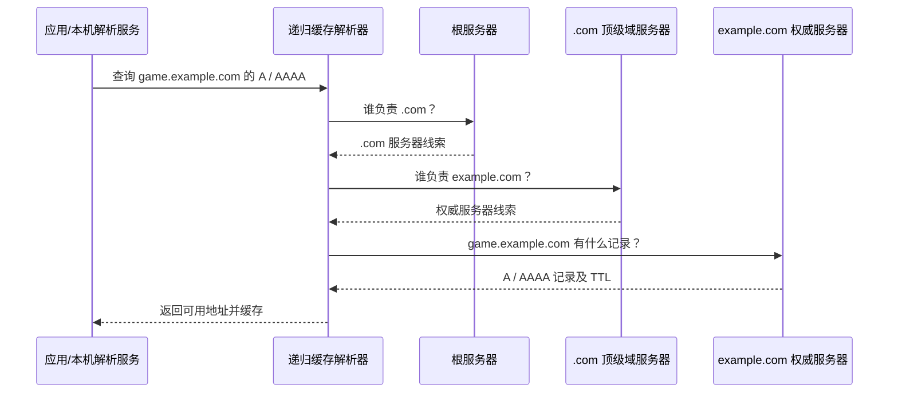

# 第 27 课：域名怎样找到服务器？——DNS 查询、委派与缓存

> 预计学习时间：约 1.5～2.5 小时。先读正文、看交互流程，再合上正文完成检查站；不需要写代码。
>
> 先备知识：[[01_核心概念|域名与 IP]]、[[05_一次发送的完整旅程|主机如何把数据交给下一跳]]、[[26_CSharp的TCP入口_Socket与NetworkStream|C# 的连接入口]]。

## 这节课要解决什么问题

你在 C# 里想连接 `game.example.com:5050`。但 TCP 连接最终要交给操作系统一组具体地址：目标 IP 和端口。`game.example.com` 是方便人记忆的名字，不是路由器能直接转发的地址。

所以在连接之前，系统需要先回答：“这个名字目前对应哪些 IP 地址？”负责查这件事的分布式命名系统叫 **DNS（Domain Name System，域名系统）**。前面的课程只提到“域名可以解析出多个地址”；本课把这句话背后的查询过程走完。

```text
应用有名字 game.example.com
          ↓ DNS 查询
得到一个或多个 IP 地址
          ↓ 选择地址并尝试连接
建立到 IP:端口 的 TCP 连接
```

DNS 只回答名字记录问题。它不会替你建立 TCP 连接，也不保证服务器在线、端口开放或游戏登录成功。

## 从一个最朴素的方案开始

最简单的办法，是让全世界每台电脑都保存一张表：

```text
game.example.com → 192.0.2.42
store.example.net → 198.51.100.17
...
```

它很快就会失效：新网站不断出现，服务器地址会更换，全球设备也不可能每次都同步下载一份完整表。更重要的是，谁有权修改其中某一条？

DNS 的关键设计是：**名字空间分层，数据由不同管理者分区负责，查询结果可以缓存。**

这不是“全世界有一台 DNS 主机”。它是一套彼此委派、协作回答的分布式数据库。

## 名字为什么分层

把名字从右向左看：

```text
game.example.com.
  game  example  com  根
```

末尾的点代表 DNS 名字树的根，平时书写常省略。根下面有顶级域，例如 `.com`；`.com` 之下可以管理 `example.com`；这个域里再定义 `game.example.com`。

这几个名字层级不意味着一定有三台不同的服务器。它表示的是管理和委派的层级：上一级知道该把某个区域的问题交给谁，具体记录由负责该区域的权威 DNS 服务器发布。

几个容易混淆的角色：

- **应用或系统的 stub resolver（存根解析器）**：代表本机程序发起查询。它通常不自己从根服务器一路查到底。
- **递归解析器 / 缓存解析器**：通常由家庭路由器、运营商或公共 DNS 服务提供。它替客户端完成查询，并缓存结果。
- **权威 DNS 服务器**：保存并发布自己负责的 DNS 区域里的记录；它不是“这个网站的游戏服务器”，两者可以完全不同。
- **根服务器、顶级域服务器**：帮助递归解析器沿着名字层级找到下一位负责者。根服务器通常不会直接给出 `game.example.com` 的最终 IP。

## 一次没命中缓存的查询

假设电脑想解析 `game.example.com`，本机缓存和递归解析器缓存中都没有答案。过程大致如下：

1. 应用把名字交给本机解析服务；本机向配置好的递归解析器发问：“请替我查 `game.example.com` 的 A / AAAA 记录。”A 表示 IPv4 地址，AAAA 表示 IPv6 地址。
2. 递归解析器先问根服务器：“谁负责 `.com`？”根服务器返回 `.com` 顶级域服务器的线索，而不是游戏服务器 IP。
3. 递归解析器再问 `.com` 服务器：“谁负责 `example.com`？”它得到 `example.com` 权威服务器的线索。
4. 递归解析器向权威服务器询问 `game.example.com`。权威服务器返回自己发布的 A、AAAA 等记录，或说明没有这种记录。
5. 递归解析器缓存答案，再把结果返回给本机；本机解析服务再把地址交给应用。
6. 应用或连接库选择一个地址，用它和端口 `5050` 尝试连接。后续仍由路由、TCP、服务器监听状态等机制决定连接是否成功。

递归解析器向客户端承担“替你查完并返回最终答复”的工作；它向根、顶级域和权威服务器逐级询问线索，这些步骤通常是一次次迭代查询。因而“递归”和“迭代”描述的是查询双方各自承担的工作，不是说每一份 DNS 消息都在沿网络递归调用程序。



真实响应里还可能有别名、多个地址、负面答案或更多委派层级；上图只保留理解主线所需的部分。

## 记录是什么

DNS 的回答不是只能写“一个名字对应一个 IP”。一个回答由资源记录（Resource Record，RR）组成，记录里包含名称、类型、值和缓存时间等信息。

| 类型 | 记录的意思 | 例子（仅为虚构演示） |
| --- | --- | --- |
| `A` | 这个名字对应一个 IPv4 地址 | `game.example.com A 192.0.2.42` |
| `AAAA` | 这个名字对应一个 IPv6 地址 | `game.example.com AAAA 2001:db8::42` |
| `CNAME` | 这个名字是另一个 DNS 名字的别名 | `match.example.com CNAME edge.example.net` |
| `NS` | 由哪些 DNS 服务器负责某个区域 | `example.com NS ns1.example.net` |

表中 IP 使用文档专用地址，不能拿来连接真实游戏服务器。一个名字也可能返回多个 A/AAAA 记录，或者先得到 CNAME，再继续查目标名字。解析器或应用可能按系统策略选择、尝试或竞速多个地址；不要假设任何平台永远只取列表第一个。

多个地址可以用于多台服务器分担流量、IPv4/IPv6 共存、按地区接入 CDN 或故障切换。但 DNS 返回地址只是提供候选目标，**不承诺这些地址都可达，也不承诺客户端一定选中某个地址**。

## TTL：为什么改了记录，大家不会同时看到

权威服务器返回记录时通常还会给它一个 **TTL（Time To Live，生存时间）**，例如 60 秒。递归解析器可以在这段时间内复用缓存答案，不必每次都从根和权威服务器重新查。

因此：

- 缓存命中时，查询通常更快、上游 DNS 流量更少；
- 权威记录改动后，已经缓存旧答案的解析器可能要等旧 TTL 到期才重新查询；
- 不同解析器在不同时间查过，缓存剩余时间也不同，所以改动不会在全世界同一瞬间生效；
- TTL 是缓存期限，不是服务器寿命，也不是“这个 IP 保证可用多久”。

缓存既是性能设计，也是分布式数据更新的取舍：查询更快、权威服务器压力更小，但短时间内不同用户可能拿到不同版本的记录。

## 查到 IP 以后，TCP 才开始解决另一类问题

可以把工作拆成两步：

```text
DNS：game.example.com → [192.0.2.42, 2001:db8::42]
TCP：选定一个地址后，尝试连接 地址:5050
```

DNS 的 A/AAAA 查询通常只处理名字和地址，不替应用决定业务端口。端口 `5050` 来自应用配置或其他应用协议约定。只有名字解析成功之后，系统才有具体目标 IP 可用于路由和 TCP 建连。

所以这些现象并不矛盾：

- DNS 成功，TCP 连接失败：可能目标服务没监听、路由不通、防火墙拦截、地址已经失效等；
- DNS 返回多个地址：连接库可能尝试其中一个或多个，失败原因仍要分别观察；
- IP 可以直连但域名不行：问题可能在解析配置或 DNS 查询环节，而不一定是 TCP 服务本身。

对 C# / Unity 来说，常见做法是把域名交给运行时或操作系统的名称解析 API，拿到 `IPAddress` 列表后再连接。底层查询和缓存通常由系统网络栈处理；具体 API 重载与平台支持要看使用的 .NET/Unity 运行时。课程后面再看 GameFrameX 时，重点仍是区分“名字解析”“连接”“应用消息”这几个不同阶段。

## DNS 是不是只用 UDP？

不是。常见查询会使用 UDP 的 53 端口，但完整 DNS 实现也必须支持 TCP 传输。需要更大的响应、UDP 响应被截断、区域传送等情形都可能涉及 TCP。DNS over HTTPS、DNS over TLS 则是在更上层再使用 HTTPS/TLS 保护 DNS 查询；它们改变传输和隐私边界，不改变“按名字查询记录”的核心职责。

本课只需记住：**DNS 是应用层的查询协议，不等同于 UDP；它可以在不同传输方式上工作。**

## 把整条链路放回熟悉的位置

```text
游戏代码提供 hostname 和 port
  → 名称解析得到候选 IP 地址
  → 连接库选择地址并请求操作系统建立 TCP 连接
  → TCP 按端点与对端建立连接
  → IP 路由把数据报逐跳送往最终 IP
  → 链路层负责当前这一跳的帧交付
```

DNS 只补上第一处缺口：把人类可读的名字变成网络可以继续使用的地址。它不取代端口、路由、ARP、TCP，也不解释游戏消息内容。

## 检查站

合上正文后，用具体情境回答；术语想不起来，可以先描述“谁问谁、得到什么”。

1. 客户端要连接 `game.example.com:5050`。DNS 查询解决什么？端口 `5050` 和 TCP 建连又分别由哪里负责？
2. 递归解析器第一次缓存未命中时，为什么要先问根服务器、再问 `.com`、再问 `example.com` 的权威服务器？根服务器通常会不会直接给出游戏 IP？
3. 本机问递归解析器时，谁替本机查完整条委派链？递归解析器自己向根、顶级域和权威服务器查询时，做的又是什么？
4. 权威记录刚改成新 IP，但一位玩家暂时仍解析到旧 IP。TTL 如何解释这个现象？TTL 是否保证旧 IP 在整个 TTL 内都能连接？
5. `game.example.com` 返回两个 IPv4 地址和一个 IPv6 地址。为什么这不代表“一个地址一定对应一台固定服务器”，也不能保证三个地址都可达？
6. DNS 查询成功，但连接 `IP:5050` 超时。至少说出两个应该继续检查的环节；为什么不能据此说 DNS 一定错了？
7. DNS 平时常见 UDP 查询，是否意味着 DNS 只能跑在 UDP 上？

## 可选观察（不算 Lab）

有电脑时可以运行 `Resolve-DnsName example.com`（PowerShell）或 `nslookup example.com`。观察返回记录的类型、地址数量和 DNS 服务器地址。不同地区、网络和时间得到的结果可能不同；如果命令失败，也先记录它发生在 DNS 查询阶段，不要马上推断网站服务一定宕机。

[打开第 27 课 DNS 查询交互](27_DNS_查询流程_交互.html)

## 参考资料

- [RFC 1034：Domain Names — Concepts and Facilities](https://www.rfc-editor.org/rfc/rfc1034)
- [RFC 1035：Domain Names — Implementation and Specification](https://www.rfc-editor.org/rfc/rfc1035)
- [RFC 7766：DNS Transport over TCP — Implementation Requirements](https://www.rfc-editor.org/rfc/rfc7766)
- [Microsoft Learn：Dns.GetHostAddressesAsync](https://learn.microsoft.com/zh-cn/dotnet/api/system.net.dns.gethostaddressesasync)
