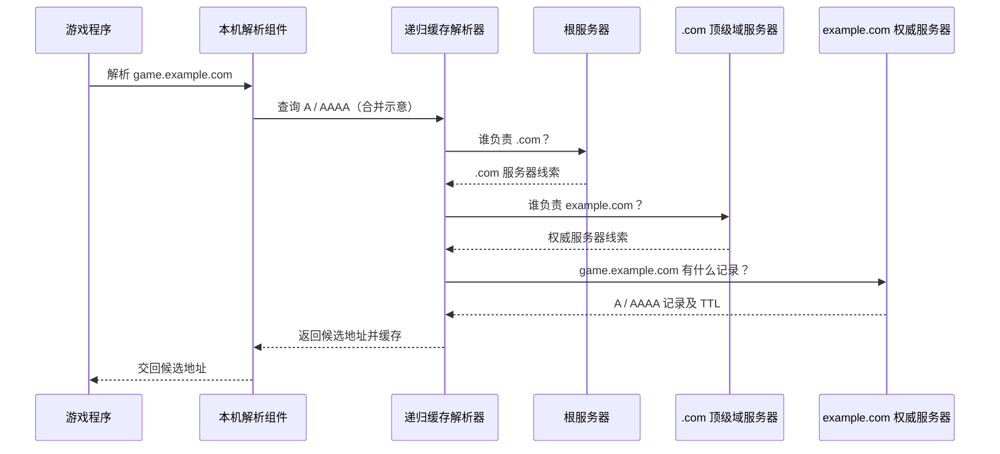

# 第 27 课：域名怎样找到服务器？——DNS 查询、委派与缓存

> 预计学习时间：约 1.5～2.5 小时。先读正文、看交互流程，再合上正文完成检查站；不需要写代码。
>
> 先备知识：[[01_核心概念|域名与 IP]]、[[05_一次发送的完整旅程|主机如何把数据交给下一跳]]、[[26_CSharp的TCP入口_Socket与NetworkStream|C# 的连接入口]]。

## 这节课要解决什么问题

你在 C# 里想连接 `game.example.com:5050`。冒号左边是服务器的域名，右边 `5050` 是游戏服务使用的端口。TCP 最终需要具体的目标 IP 和端口；路由器不能直接拿 `game.example.com` 这个名字转发数据报。

所以在连接之前，系统需要先回答：“这个名字目前对应哪些 IP 地址？”负责查这件事的分布式命名系统叫 **DNS（Domain Name System，域名系统）**。前面的课程只提到“域名可以解析出多个地址”；本课把这句话背后的查询过程走完。

```text
应用有名字 game.example.com
          ↓ DNS 查询
得到一个或多个 IP 地址
          ↓ 选择地址并尝试连接
建立到 IP:端口 的 TCP 连接
```

DNS 只回答名字记录问题。它不会替你建立 TCP 连接，也不保证服务器在线、端口开放或游戏登录成功。

## 从一个最朴素的方案开始

最简单的办法，是让全世界每台电脑都保存一张表：

```text
game.example.com → 192.0.2.42
store.example.net → 198.51.100.17
...
```

这里的 IP 是文档专用的示例地址，不能拿来连接真实服务器。

它很快就会失效：新网站不断出现，服务器地址会更换，全球设备也不可能每次都同步下载一份完整表。更重要的是，谁有权修改其中某一条？

DNS 的关键设计是：**名字空间分层，数据由不同管理者分区负责，查询结果可以缓存（暂时保存，供下次复用）。**

这不是“全世界有一台 DNS 主机”。它是一套彼此委派、协作回答的分布式数据库。

## 名字为什么分层

把 `game.example.com.` 从右向左拆开。末尾的点是根，平时常省略：

```text
.（根）
└─ com
   └─ example
      └─ game
```

根下面有顶级域，例如 `.com`；`.com` 之下可以管理 `example.com`；这个域里再定义 `game.example.com`。这里的 `game` 只是名字的一部分，并不承诺它只对应一台机器。

这几个名字层级不意味着一定有三台不同的服务器。它表示管理和委派的层级：`.com` 把 `example.com` 这部分名字的记录管理交给它的负责者，同时留下“该向谁问”的线索；负责者再发布具体记录。这就叫 **委派**，还没有发生游戏数据的 IP 转发。

要理解下面的角色，先看一个具体任务：游戏程序想连接 `game.example.com:5050`。它此时缺少 IP；DNS 查询只处理 `game.example.com`，端口 `5050` 留到连接时使用。

你的电脑并不是临时猜“该向谁问 DNS”。网络配置中已有一个 DNS 服务器的 IP：可能是连接 Wi-Fi 时自动获得的，也可能是你手动填写的。若这个地址指向家庭路由器，它可能只负责把查询转交给上游。负责替本机查到最终答案的 DNS 服务器叫递归解析器；它通常也预先有根服务器的地址线索，所以能发出第一问。假设地址答案和相关委派线索都没有缓存，过程如下：

```text
本机 → 已配置的解析器：game.example.com 的 IP 是什么？
解析器 → 根服务器：谁负责 .com？                 ← 得到 .com DNS 服务器的线索
解析器 → .com 服务器：谁负责 example.com？        ← 得到 example.com 权威服务器的线索
解析器 → 权威服务器：game.example.com 的记录是什么？ ← 得到 A 记录，例如 192.0.2.42
解析器 → 本机：查到了，地址是 192.0.2.42
```

这里“问根、问 `.com`”是解析器分别发出的 DNS 查询，并不是 IP 数据报经过路由器时逐跳询问。根服务器和 `.com` 服务器主要指出下一位该问谁；保存这条例子中最终 A 记录的是 `example.com` 的权威服务器。每次“问”都要向一台已知 IP 的 DNS 服务器发送网络数据。

现在给刚才出现的各方起正式名称：

- **存根解析器（stub resolver）**：本机负责发起 DNS 查询的部分。它代表应用把问题交给已配置的解析器，再把结果交还应用；通常不会自己从根开始逐级查询。
- **递归解析器**：刚才替本机一路查到答案的解析器。它先利用缓存；缺少答案时，继续询问其他 DNS 服务器，并把最终结果返回本机。家庭路由器也可能只是转发查询，由运营商或公共 DNS 服务的解析器完成这项工作。
- **根服务器**：告诉递归解析器“负责 `.com` 的 DNS 服务器在哪里”，通常不知道 `game.example.com` 的最终 IP。
- **顶级域服务器**：例如 `.com` 的 DNS 服务器，告诉递归解析器“负责 `example.com` 的权威服务器在哪里”。
- **权威 DNS 服务器**：发布自己负责区域的 DNS 记录。在这个例子里，它给出 `game.example.com` 的 A 记录；它可以和真正运行游戏的服务器是两台不同的机器。

## 再把缓存、IPv6 和返回路径补进去

上面只用一条 IPv4 地址示范了“谁问谁”。完整看一次连接，还要加上缓存和地址类型：

1. 应用把名字交给本机解析服务。如果本机已有有效缓存，就可能直接得到地址；否则向配置好的 DNS 服务器查询。
2. 递归解析器也先查缓存。它不仅可能缓存最终地址，还可能缓存“`example.com` 该问谁”的委派线索。有最终地址就直接回答；只有委派线索就从已知的下一位继续问；两者都没有才需要从根逐级寻找。
3. `A` 记录回答 IPv4 地址，`AAAA` 记录回答 IPv6 地址。需要两种地址时，解析器通常分别查询两种记录；权威服务器返回相应记录，也可能回答名字不存在或没有这种类型的记录。
4. 递归解析器在记录允许的时间内缓存答案，再返回给本机；本机也可能缓存。于是“再查一次”可能由本机回答，也可能由递归解析器回答。
5. 应用或连接库取得候选地址后，选择或尝试其中的地址，再与端口 `5050` 一起用于 TCP 连接。连接能否成功还取决于路由、服务器监听等后续环节。

本机给递归解析器的是“请替我找到最终答案”的任务；递归解析器给根、顶级域服务器的通常是“请告诉我下一位该问谁”的问题。它拿到线索后自己继续问，这叫迭代查询。“递归”说的是它对本机承担查到底的责任，并不是上一台 DNS 服务器代替它一路查下去。



图里把 A 和 AAAA 查询合在一条线上画，实际通常分别查询。图中的缓存都假设未命中；如果已有地址或委派线索，可以跳过相应步骤。真实响应还可能有别名、多个地址、负面答案（名字不存在或没有所问类型的记录）以及更多委派层级。

## 记录是什么

DNS 的回答不是只能写“一个名字对应一个 IP”。一个回答由资源记录（Resource Record，RR）组成，记录里包含名称、类型、值和缓存时间等信息。

| 类型 | 记录的意思 | 例子（仅为虚构演示） |
| --- | --- | --- |
| `A` | 这个名字对应一个 IPv4 地址 | `game.example.com A 192.0.2.42` |
| `AAAA` | 这个名字对应一个 IPv6 地址 | `game.example.com AAAA 2001:db8::42` |
| `CNAME` | 这个名字是另一个 DNS 名字的别名 | `match.example.com CNAME edge.example.net` |
| `NS` | 由哪些 DNS 服务器负责某个区域 | `example.com NS ns1.example.net` |

前面说的“下一位该问谁”，通常就由 `NS` 记录表示：它列出负责该区域的 DNS 服务器名字。要真的向那台服务器发查询，还需要知道它的 IP；回复可能附带其地址，也可能需要再解析这个服务器名字。所以委派线索不等于游戏服务器的 IP。

表中 IP 使用文档专用地址，不能拿来连接真实游戏服务器。一个名字也可能返回多个 A/AAAA 记录，或者先得到 CNAME，再继续查询别名所指的名字。应用或连接库可能依次尝试多个地址，也可能并行尝试；具体行为由实现决定，不要假设它永远只取第一个。

多个地址可以用于多台服务器分担流量、IPv4/IPv6 共存、按地区返回不同机房的地址，或为故障切换提供候选。但 DNS 返回地址只是提供候选目标，**不承诺这些地址都可达，也不承诺客户端一定选中某个地址**。

## TTL：为什么改了记录，大家不会同时看到

权威服务器返回记录时通常还会给它一个 **TTL（Time To Live，生存时间）**，例如 60 秒。递归解析器可以在这段时间内复用缓存答案，不必每次都从根和权威服务器重新查。

这与前面学过的 **IPv4 TTL** 同名，但不是同一个字段：IPv4 TTL 是数据报每过一台路由器就递减的跳数限制；这里的 DNS TTL 是记录允许缓存的时间，通常按秒计。

例如，玩家甲查到 `192.0.2.42`，递归解析器把记录缓存 60 秒。10 秒后，管理员修改了权威记录；此时玩家乙使用同一个递归解析器，而且自己没有缓存，仍可能拿到之前的 `192.0.2.42`。甲再次查询时，甚至可能由甲电脑上的本机缓存直接回答。这里至少有本机与递归解析器两处可能的缓存。

因此：

- 缓存命中时，查询通常更快、上游 DNS 流量更少；
- 权威记录改动后，正常遵守 TTL 的解析器可能要等旧记录到期才重新查询；
- 不同解析器在不同时间查过，缓存剩余时间也不同，所以改动不会在全世界同一瞬间生效；
- TTL 是缓存期限，不是服务器寿命，也不是“这个 IP 保证可用多久”。

缓存既是性能设计，也是分布式数据更新的取舍：查询更快、权威服务器压力更小，但短时间内不同用户可能拿到不同版本的记录。

## 查到 IP 以后，TCP 才开始解决另一类问题

可以把工作拆成两步：

```text
DNS：game.example.com → [192.0.2.42, 2001:db8::42]
TCP：选定一个地址后，尝试连接 地址:5050
```

DNS 的 A/AAAA 查询通常只处理名字和地址，不替应用决定业务端口。端口 `5050` 来自应用配置或其他应用协议约定。只有名字解析成功之后，系统才有具体目标 IP 可用于路由和 TCP 建连。

所以这些现象并不矛盾：

- DNS 成功，TCP 连接失败：可能目标服务没监听、路由不通、防火墙拦截、地址已经失效等；
- DNS 返回多个地址：连接库可能尝试其中一个或多个，失败原因仍要分别观察；
- IP 可以直连但域名不行：问题可能在解析配置或 DNS 查询环节，而不一定是 TCP 服务本身。

假设已有一个名为 `client` 的 `TcpClient` 对象，在支持该重载的 C# 运行时中，可以调用 `await client.ConnectAsync("game.example.com", 5050)`。连接库会在建连过程中触发域名解析，你不必自己先写一条 DNS 查询。也可以先调用名称解析 API，取得 `IPAddress` 列表后再尝试连接。两种写法都要经历“名字变成地址”这一步；本机解析服务与远端递归解析器可能各有自己的缓存。具体 API 和目标平台支持要看使用的 .NET/Unity 运行时。

## DNS 是不是只用 UDP？

不是。传统 DNS 查询常发往 DNS 服务器的 UDP 53 端口；查询方自己的源端口通常由系统选择。DNS 也支持 TCP 53：例如 UDP 答复装不下而被标记为截断时，可以通过 TCP 重新查询。后面讲 TLS 时再认识其他承载 DNS 查询的方式。

本课只需记住：**DNS 是应用层的查询协议，不等同于 UDP；它可以在不同传输方式上工作。**

## 把整条链路放回熟悉的位置

```text
游戏代码提供 game.example.com 和端口 5050
  → 本机向已知 IP 的解析器发 DNS 查询，得到候选服务器 IP
  → 连接库选择候选地址，TCP 生成 SYN 段并请求 IP 发送
  → IP 选择下一跳，链路层逐跳发送帧，远端 TCP 收到并回应
  → 握手完成后，应用在这条连接上交换字节
```

第一步 DNS 查询本身也是网络通信：以普通 UDP DNS 为例，查询同样要经过 UDP、IP 和当前链路，发往已知的解析器 IP。上图后半段追踪的是随后连接游戏服务器的过程；TCP 建连与 IP 逐跳传送是相互配合的，不是等 TCP 已经连接成功后 IP 才开始工作。

DNS 只补上第一处缺口：把人类可读的名字变成网络可以继续使用的地址。它不取代端口、路由、ARP、TCP，也不解释游戏消息内容。

## 检查站

合上正文后，用具体情境回答；术语想不起来，可以先描述“谁问谁、得到什么”。

1. 客户端要连接 `game.example.com:5050`。DNS 查询解决什么？端口 `5050` 和 TCP 建连又分别由哪里负责？

解决域名到ip的映射
端口由应用本身约定好
tcp建立联系由tcp部分负责，比如三次握手什么的

2. 递归解析器既没有地址答案，也没有相关委派线索时，为什么要先问根服务器、再问 `.com`、再问 `example.com` 的权威服务器？如果已缓存权威服务器的线索，还必须从根开始吗？

逐级询问对应的dns服务器，每层服务器之管好自己的那一部分就行
不需要

3. 本机问递归解析器时，谁替本机查完整条委派链？递归解析器自己向根、顶级域和权威服务器查询时，做的又是什么？

存根解析器，迭代逐级询问对应服务器，最终找到目标ip

4. 权威记录刚改成新 IP，但一位玩家暂时仍解析到旧 IP。TTL 如何解释这个现象？TTL 是否保证旧 IP 在整个 TTL 内都能连接？

说明那位玩家的主机或者解析器还缓存的有旧ip且ttl没有到期
不保证

5. `game.example.com` 返回两个 IPv4 地址和一个 IPv6 地址。程序能否假定以后总拿到相同地址、三个地址都可达，并且连接库一定只选第一个？为什么？

不能，管理员可能更换ip，而且选择ip可能会有不同策略

6. DNS 查询成功，但连接 `IP:5050` 超时。至少说出两个应该继续检查的环节；为什么不能据此说 DNS 一定错了？

在连接途中是否超时或丢包
dns只负责返回域名对应的IP，不负责建立连接

7. DNS 平时常见 UDP 查询，是否意味着 DNS 只能跑在 UDP 上？

不是，有的重要的或者很长的可以使用tcp

## 可选观察（不算 Lab）

有电脑时可以运行 `Resolve-DnsName example.com`（PowerShell）或 `nslookup example.com`。在常见的 `nslookup` 输出中，开头的 `Server / Address` 是被询问的 DNS 解析器；后面的 `Name / Addresses` 才是目标名字及其查询结果。观察记录类型和地址数量。不同地区、网络和时间得到的结果可能不同；如果命令失败，也先记录它发生在 DNS 查询阶段，不要马上推断网站服务一定宕机。

[打开第 27 课 DNS 查询交互](27_DNS_查询流程_交互.html)

## 参考资料

- [RFC 1034：Domain Names — Concepts and Facilities](https://www.rfc-editor.org/rfc/rfc1034)
- [RFC 1035：Domain Names — Implementation and Specification](https://www.rfc-editor.org/rfc/rfc1035)
- [RFC 9471：DNS Glue Requirements in Referral Responses](https://www.rfc-editor.org/rfc/rfc9471)
- [RFC 7766：DNS Transport over TCP — Implementation Requirements](https://www.rfc-editor.org/rfc/rfc7766)
- [Microsoft Learn：Dns.GetHostAddressesAsync](https://learn.microsoft.com/zh-cn/dotnet/api/system.net.dns.gethostaddressesasync)
- [Microsoft Learn：TcpClient.ConnectAsync](https://learn.microsoft.com/en-us/dotnet/api/system.net.sockets.tcpclient.connectasync)

## 检查反馈（2026-09-26，保留原答）

总体：主线基本掌握；解析器角色与具体诊断还需短复测。第 1、2、4 题正确，第 5 题判断正确；第 3 题的执行者写错，第 6 题没有列出两个具体检查点，第 7 题需要修正使用 TCP 的理由。

- 第 1 题：应用约定目标端口，通过 Socket API 请求建连；操作系统 TCP 栈执行三次握手。
- 第 3 题：替本机查完整条委派链的是**递归解析器**。本机**存根解析器**代表应用提出问题，接回结果；递归解析器在缺少缓存时，自己逐级询问根、顶级域和权威服务器。你对“逐级迭代询问”的描述是对的，名字对应的执行者需要换过来。
- 第 5 题：地址和选择策略会变；还应补上“DNS 返回某地址不证明该地址当前可达或目标端口提供服务”。
- 第 6 题：“连接超时”已是题目给出的现象；“丢包”是一种可能，但还需要具体检查位置。例如检查服务器是否在目标地址/端口监听，以及防火墙或路径是否允许这次 TCP 通信。没有监听也可能表现为立即拒绝，不能只凭超时判定唯一原因。你对 DNS 与 TCP 职责的区分正确。
- 第 7 题：DNS 可以用 TCP，但不是按“消息重不重要”分类。一个典型情境是 UDP 答复超过可承载的大小、被标记为截断，查询方改用 TCP 取得完整答复；也可以直接使用 TCP。

### 两道收尾题（可在聊天中回答）

情境：游戏要连接 `lobby.example.net:6060`。本机存根解析器 S 把查询交给递归解析器 R；R 没有地址缓存，也没有相关委派线索。

1. 接下来是 S 还是 R 分别向根、`.net` 和权威服务器查询？最终答案怎样回到本机应用？
2. 假设已经得到 IP，但连接这个 IP 的 TCP `6060` 端口失败。除 DNS 以外，写出两个你会具体检查的项目，而不只说“检查是不是超时”。
