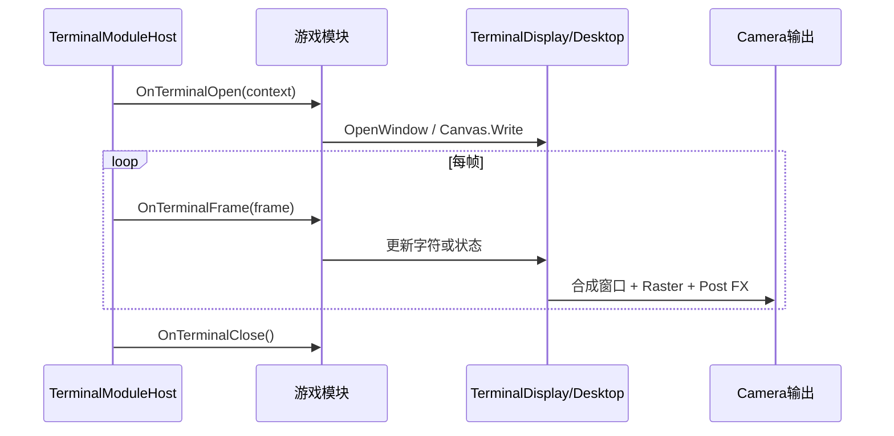

# 02 第一次运行与场景结构

## 为什么先运行 Demo

第一次接触系统时，最容易把“游戏内容”“终端窗口”“相机后处理”混成一层。先观察一个由工具自动接好的场景，可以建立正确参照，再自己从空场景搭建。

## 本章目标

- 在 Unity 2022.3 中运行 Modular Demo；
- 找到 `TerminalDisplay`、`TerminalModuleHost` 和游戏模块；
- 解释它们之间的调用关系；
- 确认当前使用的渲染管线。

## 操作一：运行最小 Demo

1. 用 Unity 2022.3.42f1c1 打开 `C:\Users\Lenovo\Desktop\新建文件夹\ASCII`。
2. 等待右下角导入/编译状态结束，先清空 Console。
3. 新建空 Scene。
4. 选择菜单 `GameObject > ASCII Terminal > Create Modular Demo`。
5. 进入 Play Mode。
6. 按 `1 / 2 / 3` 切换布局，按 `R` 切换终端分辨率。

预期现象：整个画面保持终端风格，但窗口数量、位置和占比改变。改变终端分辨率后，布局比例仍成立。

如果菜单不存在，先看 [[参考/常见故障排查#菜单不存在或脚本不能加载]]。

## 操作二：查看场景组件

选中自动创建的根对象，重点找三个角色：

### TerminalDisplay

它是显示后端和整个虚拟终端的持有者。它负责：

- 终端字符分辨率；
- 字体图集；
- 窗口合成；
- Raster Compute Shader；
- 全屏/局部后处理；
- 把结果写回 Camera。

业务代码通常不应直接操作它内部的 Material、Buffer 或 RenderTexture。

### TerminalModuleHost

它是模块宿主，负责：

- 找到同对象或子对象上的 `ITerminalModule`；
- 按顺序调用打开、每帧、输入和关闭；
- 把统一的 `TerminalModuleContext` 交给模块；
- 在旧 Input Manager 模式下转发常用键盘输入。

### DemoTerminalModule

这是实际游戏逻辑。它只知道窗口和绘图接口，不知道最终是 Built-in、URP 还是 HDRP。

## 数据流

必须读懂：模块不是每帧“生成一张图片”；模块改变的是字符 Surface 或绑定状态，显示器负责最终渲染。

## 手动搭建最小根对象

新建 Camera 或使用 Main Camera：

1. 添加 `TerminalDisplay`。
2. 添加 `TerminalModuleHost`。
3. 在 Host 的终端来源中指向同对象的 Display（若它能自动找到也建议第一次显式检查）。
4. 添加一个继承 `TerminalModuleBehaviour` 的脚本。
5. 保证每个模块的 `ModuleId` 唯一。

Built-in 管线不需要额外安装。URP/HDRP 配置放在第 16 章；初学时先让 Built-in 跑通。

## 观察—预测—验证

1. 进入 Play Mode 后禁用游戏模块，预测画面中哪些东西消失。
2. 重新启用模块，再禁用 `TerminalModuleHost`，比较差异。
3. 最后禁用 `TerminalDisplay`，观察 Camera 是否回到普通画面。

记录三次现象。不要只写“没了”，要写清楚是“不再更新”“窗口被清理”还是“最终后处理不执行”。

## 看完确认

1. 谁持有终端和窗口？
2. 谁调用模块生命周期？
3. 地图逻辑应该继承什么？
4. 为什么游戏模块不需要知道 URP Renderer Feature？
5. 如果 Console 有编译错误，为什么 Inspector 可能显示 `The associated script can not be loaded`？

完成标准：从空 Scene 搭出根对象，并能用自己的话画出上面的数据流。
