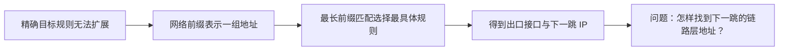
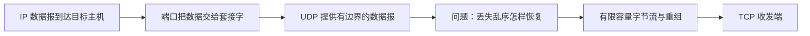

# 计算机网络：从一条消息到一个互联网

> [!quote] 这门课的主线
> 我们不从背诵“七层模型”开始。我们从两个程序怎样交换一小段字节开始，每遇到一个真实问题，就增加一个网络机制，最后让这个小模型逐渐长成一套简化的互联网。

## 当前学习点（2026-09-26）

- 上一课：[[27_DNS_域名怎样找到服务器|第 27 课：域名怎样找到服务器？——DNS 查询、委派与缓存]]（检查站待完成）
- 当前课程：[[28_NAT_端口映射与公网连入|第 28 课：知道 IP 了，为什么朋友仍连不进房间？]]
- [第 28 课交互：NAT 映射、端口转发与中继](28_NAT_公网连入_交互.html)
- 新 Lab 暂停；理论主线完成后先读 GameFrameX，再做项目。

## 早期课程进展索引

1. 第 1 课首次主动回忆已通过；记录保存在 [[01_核心概念]] 中。
2. [[02_深入理解|第 2 课：为什么要分层？]] 已基本掌握。
3. [[03_IP服务模型|第 3 课：IP 服务模型]] 的概念检查已基本掌握；命令观察待离开教室后补做。
4. 如果 C++ 有些生疏，先阅读 [[04a_Lab0所需C++暖身|Lesson 4A：Lab 0 所需的 C++ 暖身]]。
5. [[Labs/Lab0_TinyNet/README|Lesson 4 / Lab 0：TinyNet 数据报路由器]] 已通过最终验收，2026-09-03 首次复习。
6. [[05_一次发送的完整旅程|第 5 课：把一次发送完整走通]] 的理论部分已基本掌握；Lab 0 单独待检。
7. [[05b_TTL与四种延迟补充|Lesson 5B：TTL 与四种延迟补充]] 的收尾复测已通过，首次复习为 2026-09-03。
8. [[06_网络前缀与最长前缀匹配|第 6 课]] 与 [[06b_补充_前缀范围与下一跳|Lesson 6B]] 已基本掌握，首次复习为 2026-09-04。
9. [[07_Ethernet帧与局域网交付|第 7 课：Ethernet 帧与局域网交付]] 已于 2026-09-07 完成检查站，达到基本掌握；首次复习为 2026-09-08。
10. [[08_ARP与网络接口|第 8 课：ARP 与网络接口]] 已于 2026-09-07 完成检查站，达到基本掌握；首次复习为 2026-09-08。
11. [[09_网络接口状态机|第 9 课：把 ARP 变成状态机]] 已于 2026-09-08 完成检查站，达到基本掌握；[[Labs/Lab1_TinyARPInterface/README|Lab 1：Tiny ARP Network Interface]] 已通过 6/6 测试。
12. [[10_端口与UDP|第 10 课：IP 找到电脑以后——端口、套接字与 UDP]] 与 [[10b_补充_UDP首部与封装长度|Lesson 10B]] 已于 2026-09-09 完成，达到基本掌握；首次复习为 2026-09-10。
13. [[11_有限容量字节流|第 11 课：数据写得太快怎么办——有限容量字节流]] 已完成检查，达到基本掌握；首次复习为 2026-09-12。
14. [[Labs/Lab2_TinyStream/README|Lab 2：TinyStream]] 已完成验收，7/7 测试通过。
15. [[12_乱序子串重组|第 12 课：数据到了，但顺序乱了——乱序子串重组器]] 已完成检查站，达到基本掌握。
16. [[Labs/Lab3_TinyReassembler/README|Lab 3：TinyReassembler]] 已完成，窗口裁剪、去重、乱序重组、容量释放和 EOF 关闭共八组测试通过。
17. [[13_TCP接收端_序号_ACK与窗口|第 13 课：TCP 接收端——序号、ACK 与接收窗口]] 已通过收尾复测，达到基本掌握。
18. [[Labs/Lab4_TinyTCPReceiver/README|Lab 4：Tiny TCP Receiver]] 已完成，序号回绕、接收重组、累计 ACK 与窗口共十组测试通过。
19. [[14_TCP发送端_滑动窗口与重传|第 14 课：TCP 发送端——滑动窗口、超时与重传]] 已完成检查站，达到基本掌握。
20. [[Labs/Lab5_TinyTCPSender/README|Lesson 15 / Lab 5：Tiny TCP Sender]] 已完成，十一组测试全部通过，实际约 4 小时。
21. [[16_TCP连接_握手双向通信与关闭|第 16 课：TCP 连接、握手、双向通信与关闭]] 已于 2026-09-19 通过三道针对题，达到基本掌握。
22. [[17_排队_瓶颈与拥塞窗口|第 17 课：排队、瓶颈与拥塞窗口]] 已于 2026-09-19 通过四道针对题，达到基本掌握；配有出口队列与 ACK 释放额度两个逐步交互。

> [!important]
> 第 16 课检查站与针对题已通过。第 17 课从“接收端收得下，路径却送不完”出发，区分接收窗口、拥塞窗口和在途量；可在课堂完成，无新编程 Lab。

## 学习记录

- [[进度]]
- [[错题与遗漏]]
- [[复习计划]]

## 当前课程：理论主线继续

- [[26_CSharp的TCP入口_Socket与NetworkStream|第 26 课：C# 怎样接上 TCP？]] 已通过聊天检查；Lab 8 保留现状并暂停。
- [[27_DNS_域名怎样找到服务器|第 27 课：域名怎样找到服务器？——DNS 查询、委派与缓存]] 已发布；检查站待完成。
- [[28_NAT_端口映射与公网连入|第 28 课：知道 IP 了，为什么朋友仍连不进房间？——NAT、端口映射、防火墙与中继]] 是当前新课。
- [第 28 课交互：NAT 映射、端口转发与中继](28_NAT_公网连入_交互.html)
- 当前安排：先完成理论课程，不开新 Lab；之后阅读 GameFrameX，再进入项目实践。

## 第一阶段：首个 10 小时单元

| 顺序 | 内容 | 预计时间 | 状态 |
| --- | --- | ---: | --- |
| 1 | [[01_核心概念|从一条消息开始认识网络]] | 2 小时 | 基本掌握；2026-09-01 复习 |
| 2 | [[02_深入理解|分层、封装与复用]] | 2 小时 | 基本掌握；2026-09-02 复习 |
| 3 | [[03_IP服务模型|IP 服务模型]] | 2–2.5 小时 | 基本掌握；实践待补；2026-09-02 复习 |
| 4A | [[04a_Lab0所需C++暖身|Lab 0 所需的 C++ 暖身]] | 0.5–0.8 小时 | 通过 Lab 实践基本掌握；2026-09-03 复习 |
| 4 | [[Labs/Lab0_TinyNet/README|Lab 0：极小的 C++ 数据报网络]] | 2.5–4 小时 | 基本掌握；实际 125 分钟；2026-09-03 复习 |
| 5 | [[05_一次发送的完整旅程|把一次发送完整走通：复盘与概念图谱]] | 1.5–2.25 小时 | 理论基本掌握；Lab 单独待检；2026-09-03 复习 |
| 5B | [[05b_TTL与四种延迟补充|TTL 与四种延迟补充]] | 10–20 分钟 | 收尾复测通过 |

## 第二阶段：地址、链路与路由

| 顺序 | 内容 | 预计时间 | 状态 |
| --- | --- | ---: | --- |
| 6 | [[06_网络前缀与最长前缀匹配|网络前缀与最长前缀匹配]] | 1.75–2.5 小时 | 基本掌握；2026-09-04 复习 |
| 6B | [[06b_补充_前缀范围与下一跳|前缀范围、下一跳与 ARP]] | 15–25 分钟 | 收尾复测通过 |
| 7 | [[07_Ethernet帧与局域网交付|Ethernet 帧与局域网交付]] | 1.75–2.5 小时 | 基本掌握；2026-09-08 复习 |
| 8 | [[08_ARP与网络接口|ARP 与网络接口]] | 2.2–3 小时 | 基本掌握；2026-09-08 首次复习 |
| 9 | [[09_网络接口状态机|把 ARP 变成状态机]] | 1.4–1.9 小时（课堂阅读） | 基本掌握；2026-09-09 复习 |
| 1 | [[Labs/Lab1_TinyARPInterface/README|Tiny ARP Network Interface]] | 1.5–2.5 小时（电脑旁） | 已完成；测试 6/6 |

## 第三阶段：端口、字节流与可靠传输

| 顺序 | 内容 | 预计时间 | 状态 |
| --- | --- | ---: | --- |
| 10 | [[10_端口与UDP|端口、套接字与 UDP]] | 2–2.75 小时 | 基本掌握；2026-09-10 复习 |
| 10B | [[10b_补充_UDP首部与封装长度|UDP 首部与封装长度补充]] | 15–25 分钟 | 收尾复测通过 |
| 11 | [[11_有限容量字节流|有限容量字节流]] | 2.2–3 小时 | 基本掌握；2026-09-12 复习 |
| 2 | [[Labs/Lab2_TinyStream/README|TinyStream]] | 1.5–2.5 小时（电脑旁） | 已完成；7/7 测试通过 |
| 12 | [[12_乱序子串重组|乱序子串重组器]] | 2.2–3 小时 | 基本掌握；2026-09-14 复习 |
| 3 | [[Labs/Lab3_TinyReassembler/README|TinyReassembler]] | 2–3.5 小时（电脑旁） | 已完成；8/8 测试通过 |
| 13 | [[13_TCP接收端_序号_ACK与窗口|TCP 接收端：序号、ACK 与接收窗口]] | 2.5–3.5 小时 | 基本掌握；2026-09-15 复习 |
| 4 | [[Labs/Lab4_TinyTCPReceiver/README|Tiny TCP Receiver]] | 2.5–4 小时（电脑旁） | 已完成；10/10 测试通过 |
| 14 | [[14_TCP发送端_滑动窗口与重传|TCP 发送端：滑动窗口、超时与重传]] | 2.5–3.25 小时 | 基本掌握；2026-09-16 复习 |
| 5 | [[Labs/Lab5_TinyTCPSender/README|Tiny TCP Sender]] | 3–5 小时（电脑旁） | 已完成；11/11；实际约 4 小时 |
| 16 | [[16_TCP连接_握手双向通信与关闭|TCP 连接：握手、双向通信与关闭]] | 2.5–3.25 小时 | 基本掌握；2026-09-20 复习 |

## 第四阶段：排队、性能与拥塞控制

| 顺序 | 内容 | 预计时间 | 状态 |
| --- | --- | ---: | --- |
| 17 | [[17_排队_瓶颈与拥塞窗口|排队、瓶颈与拥塞窗口]] | 80～120 分钟 | 基本掌握；2026-09-20 复习 |
| 18 | [[18_TCP拥塞控制_慢启动与拥塞避免|TCP 拥塞控制：慢启动、拥塞避免与丢包回退]] | 1.75～2.5 小时 | 基本掌握；2026-09-21 复习 |
| 6 | [[Labs/Lab6_TinyNetworkInterface/README|Tiny Network Interface]] | 3～5 小时（电脑旁，可分两次） | 已完成；11/11 测试通过 |

[第 17 课交互：出口队列与 ACK 释放额度](17_排队_瓶颈与拥塞窗口_交互.html)

[第 18 课交互：让拥塞窗口试探、回退、再试探](18_TCP拥塞控制_交互.html)

## 第五阶段：路由怎样产生并适应变化

| 顺序 | 内容 | 预计时间 | 状态 |
| --- | --- | ---: | --- |
| 20 | [[20_路由表从哪里来_转发平面与控制平面|路由表从哪里来：转发平面、控制平面与路由收敛]] | 1.75～2.5 小时 | 基本掌握；收尾迁移通过 |
| 21 | [[21_距离向量环路与计数到无穷|坏消息为什么传得慢：距离向量环路与计数到无穷]] | 1.75～2.5 小时 | 基本掌握；针对题通过 |

[第 20 课交互：链路断开后，旧 FIB 怎样变成新 FIB](20_路由收敛_交互.html)

[第 20 课 A4 打印版](output/pdf/20_路由表从哪里来_打印版.pdf)

[第 21 课交互：朴素距离向量与毒性逆转](21_计数到无穷_交互.html)

## 后续实践形式

根据实际 Lab 体验，后续不再把完整 C++ 协议组件作为必修重心。路由器实现降为选修或 1～2 小时机制模拟，主要实践转入 Unity/C#：

1. **Unity Shared World**：两个本地进程、网络对象身份、所有权、服务器权威与最小状态复制；
2. **Unity Messages**：序列化、可靠/不可靠消息、输入与事件；
3. **Unity Movement**：快照、插值、客户端预测与服务器校正；
4. **Unity Multiplayer Mini Game**：把连接、同步、带宽观察和断线处理接成一个小型项目。

C++ TinyRouter 保留为以后想深入网络系统时的选修项目。每个 Unity 项目仍从空项目或最小场景开始，由学习者参与决定组件边界，不要求单独实验报告。

## 第六阶段：从网络原理进入 Unity 联机

| 顺序 | 内容 | 预计时间 | 状态 |
| --- | --- | ---: | --- |
| 22 | [[22_Unity联机第一步_两个进程与一个世界|Unity 联机第一步：两个进程、身份、所有权与权威]] | 2～2.75 小时 | 基本掌握 |
| 23 | [[23_Unity消息_事件状态与可靠性|这条消息该不该重传？——事件、状态与时效]] | 1.5～2 小时 | 基本掌握 |
| 24 | [[24_TCP消息边界与长度前缀|TCP 只给字节流，消息边界由谁恢复？]] | 1.5～2 小时 | 基本掌握 |
| 25 | [[25_应用消息包络与分派|完整消息到达后，程序怎样知道交给谁？——消息包络、分派与请求关联]] | 3～4 小时 | 新课已发布；待学习 |

Lab 7 的 NGO API 实验暂缓。第 23 课讲消息语义与时效，第 24 课讲 TCP 分帧，第 25 课讲完整消息的识别、分派和请求关联；随后再从零搭建 C# 消息通信，不要求先背框架 API。

[第 22 课交互：一次移动怎样进入权威世界](22_Unity联机状态流_交互.html)

[第 23 课交互：旧快照与重要请求](23_Unity消息_交互.html)

[第 24 课交互：消息被切开和合并时怎样拆帧](24_TCP消息边界_交互.html)

[第 25 课交互：两个请求、响应乱序返回](25_消息分派_交互.html)

## 使用说明

- 文中的 `[[双向链接]]` 可以直接在 Obsidian 中跳转。
- 遇到 `想一想` 时，先停十秒再展开后文；主动猜测比直接看答案更有价值。
- 命令执行失败也是观察结果，不要急着把失败当成自己做错了。
- Lab 的目标是看见机制运转，不是追求代码量。
- 暂时不需要背缩写；同一个概念遇到三次以后，缩写自然会留下来。

## 约定

- 理论机制仍使用 C++20、伪代码和协议字段说明；后续必修实践以 C# / Unity 为主。
- Unity 实验环境：Windows + 实际安装的 Unity 版本；开始 Lab 前固定编辑器与网络包版本。
- C++ 实验环境：Windows + WSL2 + CMake，仅用于已完成 Lab 与可选底层深挖。
- 掌握标准：能用自己的话解释、能预测一个变化的后果、能通过实验验证。
