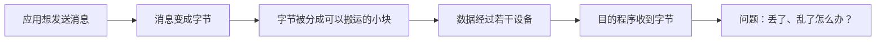

# 计算机网络：从一条消息到一个互联网

> [!quote] 这门课的主线
> 我们不从背诵“七层模型”开始。我们从两个程序怎样交换一小段字节开始，每遇到一个真实问题，就增加一个网络机制，最后让这个小模型逐渐长成一套简化的互联网。

## 现在从这里开始

1. 阅读 [[课程总路线]]，只需要了解我们最终要去哪里。
2. 开始 [[01_核心概念|第 1 课：一条 Unity 消息是怎样离开电脑的？]]。
3. 完成第 1 课末尾的检查站，把答案直接发给老师。
4. 老师会根据答案更新 [[进度]]、[[错题与遗漏]] 和 [[复习计划]]，再生成下一课。

> [!important]
> 当前只开放第 1 课。后续课程不会一次性全部生成，因为“看过”不等于“掌握”。每通过一个检查站，我们再往网络模型中增加一个新机制。

## 学习记录

- [[进度]]
- [[错题与遗漏]]
- [[复习计划]]

## 第一阶段：首个 10 小时单元

| 顺序 | 内容 | 预计时间 | 状态 |
| --- | --- | ---: | --- |
| 1 | [[01_核心概念|从一条消息开始认识网络]] | 2 小时 | 进行中 |
| 2 | 分层、封装与复用 | 2 小时 | 等待解锁 |
| 3 | IP 服务模型 | 2 小时 | 等待解锁 |
| 4 | Lab 0：极小的 C++ 数据报网络 | 3 小时 | 等待解锁 |
| 5 | 复盘与概念图谱 | 1 小时 | 等待解锁 |

## 使用说明

- 文中的 `[[双向链接]]` 可以直接在 Obsidian 中跳转。
- 遇到 `想一想` 时，先停十秒再展开后文；主动猜测比直接看答案更有价值。
- 命令执行失败也是观察结果，不要急着把失败当成自己做错了。
- Lab 的目标是看见机制运转，不是追求代码量。
- 暂时不需要背缩写；同一个概念遇到三次以后，缩写自然会留下来。

## 约定

- 主实现语言：C++20。
- 应用侧联系：C# / Unity，只在能帮助理解网络机制时出现。
- 实验环境：Windows + WSL2 + CMake。
- 掌握标准：能用自己的话解释、能预测一个变化的后果、能通过实验验证。

