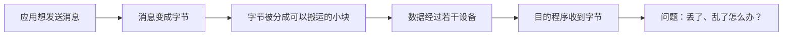

# 计算机网络：从一条消息到一个互联网

> [!quote] 这门课的主线
> 我们不从背诵“七层模型”开始。我们从两个程序怎样交换一小段字节开始，每遇到一个真实问题，就增加一个网络机制，最后让这个小模型逐渐长成一套简化的互联网。

## 现在从这里开始

1. 第 1 课首次主动回忆已通过；记录保存在 [[01_核心概念]] 中。
2. [[02_深入理解|第 2 课：为什么要分层？]] 已基本掌握。
3. [[03_IP服务模型|第 3 课：IP 服务模型]] 的概念检查已基本掌握；命令观察待离开教室后补做。
4. 如果 C++ 有些生疏，先阅读 [[04a_Lab0所需C++暖身|Lesson 4A：Lab 0 所需的 C++ 暖身]]。
5. [[Labs/Lab0_TinyNet/README|Lesson 4 / Lab 0：TinyNet 数据报路由器]] 已通过最终验收，2026-09-03 首次复习。
6. [[05_一次发送的完整旅程|第 5 课：把一次发送完整走通]] 的理论部分已基本掌握；Lab 0 单独待检。
7. [[05b_TTL与四种延迟补充|Lesson 5B：TTL 与四种延迟补充]] 的收尾复测已通过，首次复习为 2026-09-03。

> [!important]
> 第 5 课理论部分与 Lab 0 均已通过。后续 Lab 报告改用精简证据格式，避免无意义的重复填写。

## 学习记录

- [[进度]]
- [[错题与遗漏]]
- [[复习计划]]

## 第一阶段：首个 10 小时单元

| 顺序 | 内容 | 预计时间 | 状态 |
| --- | --- | ---: | --- |
| 1 | [[01_核心概念|从一条消息开始认识网络]] | 2 小时 | 基本掌握；2026-09-01 复习 |
| 2 | [[02_深入理解|分层、封装与复用]] | 2 小时 | 基本掌握；2026-09-02 复习 |
| 3 | [[03_IP服务模型|IP 服务模型]] | 2–2.5 小时 | 基本掌握；实践待补；2026-09-02 复习 |
| 4A | [[04a_Lab0所需C++暖身|Lab 0 所需的 C++ 暖身]] | 0.5–0.8 小时 | 通过 Lab 实践基本掌握；2026-09-03 复习 |
| 4 | [[Labs/Lab0_TinyNet/README|Lab 0：极小的 C++ 数据报网络]] | 2.5–4 小时 | 基本掌握；实际 125 分钟；2026-09-03 复习 |
| 5 | [[05_一次发送的完整旅程|把一次发送完整走通：复盘与概念图谱]] | 1.5–2.25 小时 | 理论基本掌握；Lab 单独待检；2026-09-03 复习 |
| 5B | [[05b_TTL与四种延迟补充|TTL 与四种延迟补充]] | 10–20 分钟 | 收尾复测通过 |

## 使用说明

- 文中的 `[[双向链接]]` 可以直接在 Obsidian 中跳转。
- 遇到 `想一想` 时，先停十秒再展开后文；主动猜测比直接看答案更有价值。
- 命令执行失败也是观察结果，不要急着把失败当成自己做错了。
- Lab 的目标是看见机制运转，不是追求代码量。
- 暂时不需要背缩写；同一个概念遇到三次以后，缩写自然会留下来。

## 约定

- 主实现语言：C++20。
- 应用侧联系：C# / Unity，只在能帮助理解网络机制时出现。
- 实验环境：Windows + WSL2 + CMake。
- 掌握标准：能用自己的话解释、能预测一个变化的后果、能通过实验验证。
